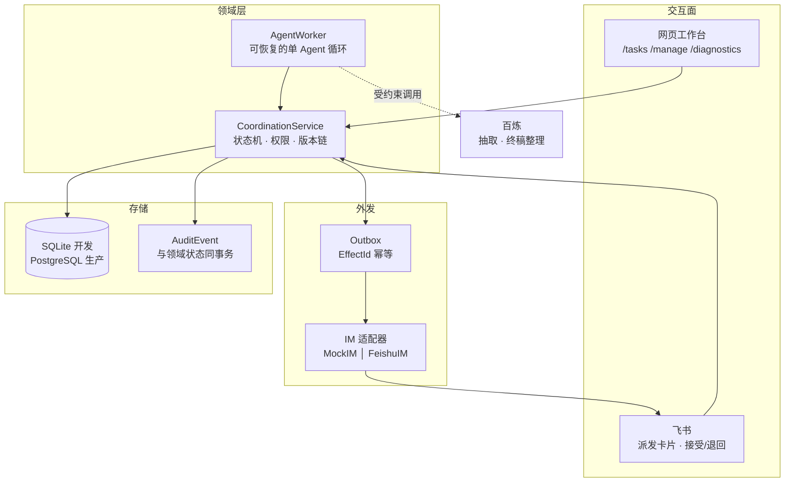

# 多同事会议行动项协作 Agent

把一份会议逐字稿，推进成一份被人验收放行的终稿。

**分工原则只有一条：模型提议，人决定。** 身份、任务状态、催办等级、审批和版本指针从不由模型决定——模型只负责抽取候选行动项和受约束的终稿语义整理，两处产出都要过确定性校验，且都不能推进状态。

---

## 它解决什么

会议开完，行动项散落在逐字稿里。谁负责、什么时候交、交什么、交了算不算数——这些在真实团队里靠人反复追问。本项目把这条链路做成可恢复、可审计、可幂等的工作流：

| 阶段 | 谁在动 | 产出 |
|---|---|---|
| 抽取 | 模型 + 确定性校验 | 带原文出处的候选行动项 |
| 复核派发 | 会议负责人 | 任务定义、团队要求完成时间、一名主负责人 + N 名协作者 |
| 逐个响应 | 每个被派发的人 | 全部接受才进入执行；任一退回则整轮作废 |
| 执行协作 | 负责人 + 协作者 | 版本化的贡献与最终候选 |
| 验收 | 会议负责人 | 冻结的已验收结果 |
| 终稿放行 | 会议负责人 | 带完整 lineage 的终稿 → 归档 |

完整交互流程、状态机与权限边界见 [`colwrok_SDD/07-state-machines.md`](colwrok_SDD/07-state-machines.md)。

---

## 架构



**模块化单体。** 网页和 Agent Worker 是两个独立进程，共享同一个数据库；工作流状态全部外置，进程中断后按原版本和 EffectId 恢复。

---

## 技术要点

**EffectId 幂等贯穿全链路。** 每个外部效应由 `(episode, subject, effect_type, trigger_key)` 导出稳定 ID。重试复用原 ID，已投递不可逆。接入飞书后这个 ID 直接作为飞书发消息接口的 `uuid` 幂等键——进程在"飞书已接收、本地未落库"之间崩溃时，重试由飞书返回原消息，而不是给收件人发第二条。

**领域状态、审计事件与 Outbox 同事务。** 不存在"状态改了但审计没记"或"审计记了但效应没排队"的中间态。

**同一份适配器契约，两种实现。** `MockIM` 与 `FeishuIM` 签名一致，所以确定性评测继续用 Mock，生产切到真实租户时派发器一行未改。

**两个存储后端共享一套领域语义。** 开发用 SQLite，生产目标 PostgreSQL（[权威 DDL](db/postgres_schema.sql)）。CI 两个后端都跑同一套测试。

**HITL 边界是显式的。** 参会名单必须显式提供，系统不从逐字稿猜谁参会。把协作贡献正文发送给模型需要部署级授权开关，附件二进制永不发送。

---

## 快速开始

```powershell
python -m pip install -e ".[feishu]"
$env:PYTHONPATH = "src"

# 227 个测试，零外部调用
python -m unittest discover -s tests

# 确定性 P0 场景评测，输出 var/report.json
python -m collab_agent eval --fresh

# 本地工作台
python -m collab_agent serve
```

一键配置 `.venv`、Psycopg 与便携 PostgreSQL 18（无需管理员权限）：

```powershell
powershell -ExecutionPolicy Bypass -File scripts/setup_dev.ps1
```

---

## 跑一场真实会议

**1. 抽取候选行动项**

```powershell
python -m collab_agent extract `
  --input "C:\path\meeting.txt" `
  --output var\extractions\meeting.json `
  --meeting-date 2026-03-02
```

**2. 两个进程，共享同一个库**

```powershell
# 终端 1：网页工作台，只处理人的交互
python -m collab_agent serve-meeting `
  --extraction var\extractions\meeting.json --transcript "C:\path\meeting.txt" `
  --organization "你的团队" --coordinator "会议负责人" `
  --participant "甲" --participant "乙" `
  --postgres --result-processing bailian

# 终端 2：Agent Worker，恢复并推进数据库里的下一步
python -m collab_agent agent-meeting `
  --extraction var\extractions\meeting.json --transcript "C:\path\meeting.txt" `
  --organization "你的团队" --coordinator "会议负责人" `
  --participant "甲" --participant "乙" `
  --postgres --result-processing bailian
```

打开 `http://127.0.0.1:8766/manage` 复核并派发。

**参会名单是权限边界，必须显式提供。** 同一会议再次载入时名单必须一致，避免悄悄改变已建立的派发与协作权限。

---

## 飞书接入

派发通知、接受与退回搬到飞书；修订定义、提交交付物、验收仍在网页——它们需要表单和附件。

```powershell
# 先载入会议建立参会者，再绑定（绑定键是 actor_id，命令接受显示名并自动解析）
python -m collab_agent feishu-bind --postgres --actor "甲" --open-id "ou_xxxx"

# 长连接：免公网 IP、免内网穿透、免自己验签
python -m collab_agent feishu-serve `
  --extraction var\extractions\meeting.json --transcript "C:\path\meeting.txt" `
  --organization "你的团队" --coordinator "会议负责人" `
  --participant "甲" --participant "乙" --postgres
```

需要在 `.env.local` 写入 `FEISHU_APP_ID` 与 `FEISHU_APP_SECRET`（见 [`.env.example`](.env.example)）。启动约 17–20 秒，这段时间无输出是 lark SDK 在导入。

**派发通知需要一层投影。** 本项目的派发是拉取式的——只记录谁被指派，不产生 Outbox 效应，因为网页工作台预期成员自己去看。飞书需要推送，所以 `AssignmentNotifier` 把"待响应的派发"投影成卡片。EffectId 由 `(任务, 定义版本, 人)` 这个天然键导出，重启和重复轮询都解析到同一效应；修订后重新派发抬高定义版本，那是真正的新效应，应该再次送达。

**三层幂等**，各防各的失败：飞书服务端 `uuid` 防重复送达，入站动作表按飞书 `event_id` 防重复排队，入站回执表按同一个 `event_id` 防**重复决策**。

---

## 测试与评测

```powershell
python -m unittest discover -s tests -v          # 227 个，含飞书适配器契约、崩溃恢复、幂等、权限边界
python -m collab_agent eval --fresh              # 确定性 P0 场景
python -m collab_agent eval-ai-p0 --fresh        # AI 工程 Harness，零外部调用
python -m collab_agent eval-product              # 人工成本、引用率、Token、闸口
python -m collab_agent eval-extraction           # 抽取质量，含公开基线对照
```

PostgreSQL 集成测试通过环境变量启用（不设则跳过）：

```powershell
$env:COLWORK_TEST_POSTGRES_URL = "postgresql://..."
python -m unittest discover -s tests
```

固定评测不是预分配任务的捷径：四个 ActionItem 初始 owner 为空，场景真实执行负责人复核/派发、成员响应、双工期冲突、求助、多格式提交、退回重交、崩溃恢复、终稿被新版本替换和最终归档。

---

## 设计文档

`colwrok_SDD/` 下有 18 篇系统设计文档和 13 个 ADR，包括领域模型、事件目录、状态机、接口契约、验收测试计划和可追溯矩阵。入口：[`colwrok_SDD/00-README.md`](colwrok_SDD/00-README.md)。

---

## 当前边界

- 单 Episode 内串行事件循环与 VirtualClock；数据库允许多个 Episode 并存
- 外部模型仅用于候选抽取与受约束的终稿整理，不决定身份、状态、审批或版本指针
- 模型失败由持久化重试状态与 Outbox 记录，不静默降级为简单终稿
- 第三方语料只引用不入库；`datasets/` 已在 `.gitignore` 中
