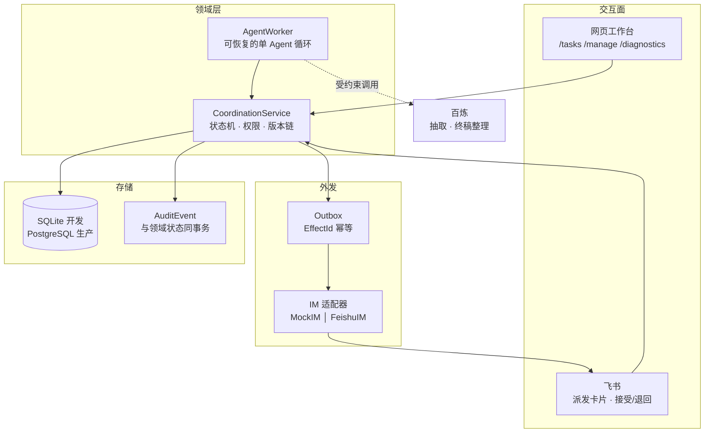

# 多同事会议行动项协作 Agent

把一份会议逐字稿，推进成一份被人验收放行的终稿。

**分工原则只有一条：模型提议，人决定。** 身份、任务状态、催办等级、审批和版本指针从不由模型决定——模型只负责抽取候选行动项和受约束的终稿语义整理，两处产出都要过确定性校验，且都不能推进状态。

---

## 它解决什么

会议开完，行动项散落在逐字稿里。谁负责、什么时候交、交什么、交了算不算数——这些在真实团队里靠人反复追问。本项目把这条链路做成可恢复、可审计、可幂等的工作流：

| 阶段 | 谁在动 | 产出 |
|---|---|---|
| 抽取 | 模型 + 确定性校验 | 带原文出处的候选行动项 |
| 复核派发 | 会议负责人 | 任务定义、团队要求完成时间、一名主负责人 + N 名协作者 |
| 逐个响应 | 每个被派发的人 | 全部接受才进入执行；任一退回则整轮作废 |
| 执行协作 | 负责人 + 协作者 | 版本化的贡献与最终候选 |
| 验收 | 会议负责人 | 冻结的已验收结果 |
| 终稿放行 | 会议负责人 | 带完整 lineage 的终稿 → 归档 |

完整交互流程、状态机与权限边界见 [`colwrok_SDD/07-state-machines.md`](colwrok_SDD/07-state-machines.md)。

---

## 架构



**模块化单体。** 网页和 Agent Worker 是两个独立进程，共享同一个数据库；工作流状态全部外置，进程中断后按原版本和 EffectId 恢复。

---

## 技术要点

**EffectId 幂等贯穿全链路。** 每个外部效应由 `(episode, subject, effect_type, trigger_key)` 导出稳定 ID。重试复用原 ID，已投递不可逆。接入飞书后这个 ID 直接作为飞书发消息接口的 `uuid` 幂等键——进程在"飞书已接收、本地未落库"之间崩溃时，重试由飞书返回原消息，而不是给收件人发第二条。

**领域状态、审计事件与 Outbox 同事务。** 不存在"状态改了但审计没记"或"审计记了但效应没排队"的中间态。

**同一份适配器契约，两种实现。** `MockIM` 与 `FeishuIM` 签名一致，所以确定性评测继续用 Mock，生产切到真实租户时派发器一行未改。

**两个存储后端共享一套领域语义。** 开发用 SQLite，生产目标 PostgreSQL（[权威 DDL](db/postgres_schema.sql)）。CI 两个后端都跑同一套测试。

**HITL 边界是显式的。** 参会名单必须显式提供，系统不从逐字稿猜谁参会。把协作贡献正文发送给模型需要部署级授权开关，附件二进制永不发送。

---

## 快速开始

```powershell
python -m pip install -e ".[feishu]"
$env:PYTHONPATH = "src"

# 全部测试，零外部模型调用
python -m unittest discover -s tests

# 确定性 P0 场景评测，输出 var/report.json
python -m collab_agent eval --fresh

# 本地工作台
python -m collab_agent serve
```

一键配置 `.venv`、Psycopg 与便携 PostgreSQL 18（无需管理员权限）：

```powershell
powershell -ExecutionPolicy Bypass -File scripts/setup_dev.ps1
```

---

## 跑一场真实会议

**1. 抽取候选行动项**

```powershell
python -m collab_agent extract `
  --input "C:\path\meeting.txt" `
  --output var\extractions\meeting.json `
  --meeting-date 2026-03-02
```

**2. 两个进程，共享同一个库**

```powershell
# 终端 1：网页工作台，只处理人的交互
python -m collab_agent serve-meeting `
  --extraction var\extractions\meeting.json --transcript "C:\path\meeting.txt" `
  --organization "你的团队" --coordinator "会议负责人" `
  --participant "甲" --participant "乙" `
  --postgres --result-processing bailian

# 终端 2：Agent Worker，恢复并推进数据库里的下一步
python -m collab_agent agent-meeting `
  --extraction var\extractions\meeting.json --transcript "C:\path\meeting.txt" `
  --organization "你的团队" --coordinator "会议负责人" `
  --participant "甲" --participant "乙" `
  --postgres --result-processing bailian
```

打开 `http://127.0.0.1:8766/manage` 复核并派发。

**参会名单是权限边界，必须显式提供。** 同一会议再次载入时名单必须一致，避免悄悄改变已建立的派发与协作权限。

---

## 飞书接入

派发通知、接受与退回搬到飞书；修订定义、提交交付物、验收仍在网页——它们需要表单和附件。

```powershell
# 先载入会议建立参会者，再绑定（绑定键是 actor_id，命令接受显示名并自动解析）
python -m collab_agent feishu-bind --postgres --actor "甲" --open-id "ou_xxxx"

# 长连接：免公网 IP、免内网穿透、免自己验签
python -m collab_agent feishu-serve `
  --extraction var\extractions\meeting.json --transcript "C:\path\meeting.txt" `
  --organization "你的团队" --coordinator "会议负责人" `
  --participant "甲" --participant "乙" --postgres
```

需要在 `.env.local` 写入 `FEISHU_APP_ID` 与 `FEISHU_APP_SECRET`（见 [`.env.example`](.env.example)）。启动约 17–20 秒，这段时间无输出是 lark SDK 在导入。

**派发通知需要一层投影。** 本项目的派发是拉取式的——只记录谁被指派，不产生 Outbox 效应，因为网页工作台预期成员自己去看。飞书需要推送，所以 `AssignmentNotifier` 把"待响应的派发"投影成卡片。EffectId 由 `(任务, 定义版本, 人)` 这个天然键导出，重启和重复轮询都解析到同一效应；修订后重新派发抬高定义版本，那是真正的新效应，应该再次送达。

**三层幂等**，各防各的失败：飞书服务端 `uuid` 防重复送达，入站动作表按飞书 `event_id` 防重复排队，入站回执表按同一个 `event_id` 防**重复决策**。

---

## Docker

三个长驻部件对应真实部署形态：PostgreSQL、只处理人机交互的网页工作台、恢复并推进数据库里下一步的 Agent Worker。飞书长连接是第四个，放在 profile 后面，因为它需要凭据和真实租户。

```bash
cp .env.docker.example .env      # 编辑：密码、会话密钥、会议与参会名单
cp <你的抽取结果> meetings/extraction.json
cp <你的逐字稿>   meetings/transcript.txt

docker compose up -d --build     # db + workbench + worker
docker compose --profile feishu up -d       # 追加飞书长连接
docker compose --profile tools run --rm eval   # 确定性评测
```

工作台在 `http://localhost:8766`。

> **尚未验证。** 这套 compose 是按代码实际行为写的，但作者机器上没有安装 Docker，所以从未真正 build 或 up 过。第一次跑如果有问题，最可能出在镜像构建的依赖解析上。

两个不显然的点：容器里必须传 `--host 0.0.0.0`，CLI 默认 `127.0.0.1` 会让发布出去的端口什么都不响应；`DATABASE_URL` 只从 `.env.local` 读而不认环境变量（这是刻意的，防止工作台和 Worker 被环境里的游离变量拆到两个库），所以入口脚本会用 compose 传进来的值现场生成这个文件。

---

## 抽取：让模型先查证再引用

抽取默认是一次性的：模型读一遍片段就吐候选，`source_quote` 由 `align_source_evidence` 事后跟原文比对并在能唯一定位时修正时间戳，仍对不上才触发一次模型修复轮。

我们做过一个对照组：把这个顺序反过来，给模型三个只读工具（`search_transcript` / `get_context` / `list_speakers`），让它先查证再引用，prompt 独立版本化为 `meeting-action-items.tools.v2.0`。

**实测更差，已决定不采用。** held-out 8 场：

| | v1.4 | tools.v2.0 |
|---|---|---|
| 抽取量 | 49 | 94 |
| 真阳性 | 5 | 3 |
| F1 | 0.1538 | 0.0556 |
| 引文可定位率 | 1.0 | 1.0 |
| 硬失败 | 0 场 | 2 场 |

原因不是工具实现得差，是**这个操作本来就不该交给模型**。`align_source_evidence` 在引文对不上时会扫描全部发言找唯一匹配位置——那正是 `search_transcript` 做的事，连空白折叠都是同一行 `re.sub(r"\s+", " ", ...)`。代码做这件事是确定性的、零 token、100% 可靠；交给模型就变成概率性、收费、还可能用错结果。v1.4 硬失败 0 场且可定位率已是 1.0，说明确定性搜索已经解决了每一条引文，没有残留给工具去修。

副作用是精确率崩塌：抽取量翻倍而真阳性反降，模型倾向于"查证到了所以它是真的"。

由此得到的判据，比这次实验本身有用：

> **一个操作如果能在事后确定性地校验或修复，就不该做成工具交给模型。**

引文定位可以事后校验，所以它属于代码。跨会议关联（"这条任务是不是上次那条的延续"）没有可比对的真值字符串，事后无法确定性校验——那才是工具的正当场景。

代码保留在 `--tools` 后面并默认关闭，作为可复现的对照组；33 个离线测试覆盖其逻辑。复现对打：

```powershell
python -m collab_agent eval-extraction `
  --alimeeting4mug <数据集根目录> --split dev `
  --with-project-chain --with-project-chain-tools
```

输出里的 `tool_use` 记录每次查询、失败调用数和触发轮次上限的片段数；`usage` 把每一轮 token 都算进去。

---

## 跨会议关联

一条新行动项是不是在延续以往会议中的某一条？现在没人知道，只能靠人记。

```powershell
# 提议（确定性地板，零 token）
python -m collab_agent link propose --postgres --actor "王昱翔"
# 加上模型，找地板看不出的改述延续（消耗 token）
python -m collab_agent link propose --postgres --actor "王昱翔" --with-model

python -m collab_agent link list --postgres
python -m collab_agent link confirm --postgres --link-id lnk_xxx --actor "王昱翔"
```

**授权边界直接沿用参会名单**：候选池 = 同组织 + 不同 Episode + **请求人当时在那场会的名单里**。在这场会不等于有资格看上一场——这条有专门的测试，也覆盖了"另一个组织的行动项永不出现"。

**没做检索，是全上下文。** 候选池整个塞进 prompt。三场会 18 条行动项渲染后不到一千 token，授权过滤后更少。检索要到千条量级（百场会议以上）才成为必需，现在做就是无法测量的基础设施——这跟砍掉 `agent_result_cache` 是同一条纪律。`candidate_pool` 是将来插入检索的唯一位置。

**为什么这里该用模型。** 确定性地板（`DeterministicLinker`）能抓 `identity_key` 相同和标题高度相似，零成本，因此模型必须赢过它才算称职。地板抓不到的是「整理采访问题清单」延续「汇总大家提的问题清单」——同一件事，无共同子串。而语义延续**没有可事后比对的真值字符串**，无法用确定性代码事后修复。这正好通过了工具调用那次没通过的判据。

**模型不能做的**：提议一个不在候选池里的 id。每个返回的 id 都对池校验，编造的直接丢弃——跟 `source_quote` 同一套接地纪律。`PROPOSED` 不改变任何任务状态，只有人能把它变成 `CONFIRMED`；`UNIQUE(action_item_id, prior_action_item_id)` 保证重跑提议器不会复活一条已被否决的关联。

**候选池是"其他会议"，不是"更早的会议"。** `episodes.created_sim_time` 记的是载入时间而非会议日期，会议日期没有持久化，所以乱序导入会让顺序失真。CONTINUATION 的方向由模型读两条标题判定，不由这个排序保证——**请从较晚的那场会跑关联**，这样记下的 `prior_action_item_id` 才真的是更早那条。要让查询本身强制方向，需要把会议日期落到 episode 上。

### 从飞书妙记取会议

逐字稿、参会名单、open_id 这三样本来都要人工搬一遍，而它们都已经在飞书里。

```powershell
python -m collab_agent feishu-intake `
  --minute-token <妙记链接末段> --chat-id <群 ID> `
  --output var\transcripts\meeting.txt
```

输出逐字稿（已是 `发言人(HH:MM:SS): 内容` 格式，抽取器直接能吃）+ 一份名单提议，分成三类：

| 分类 | 含义 |
|---|---|
| 发言且在群里 | 可直接作为参会人，附 open_id |
| 发言但不在群里 | 转写变体或外部人员，需要你判断 |
| 在群里但全程未发言 | 可能到场没说话，也可能根本没参会 |

**刻意不自动建 Episode。** 群成员 ≠ 参会者——群里有会后加入的人，也有没来的人；而逐字稿漏掉全程沉默的人。两份名单都不是授权边界本身，所以命令只打印现成的 `--participant` 和 `feishu-bind` 命令，由你确认后执行。**省掉打字值得，省掉判断不值得。**

需要在控制台开两个权限：查看与下载妙记、获取群成员信息。

> **从未对真实租户跑过。** 解析器和名单调和有 17 个离线测试，但妙记导出的确切返回格式在公开文档里没查到，所以解析器同时认 SRT 和逐行格式，两者都不匹配时会把原始内容开头打出来——第一次真实运行如果失败，一眼就能看出该补哪个分支。

### 稳定演示

演示时调模型会在观众面前重跑一个不确定的步骤：同一场会可能给出不同候选，一次限流就能带走整个演示。所以可以从已校验的人工标注派生抽取文件：

```powershell
python -m collab_agent check-annotation --cases fixtures\meeting_gold_20260302.json
python -m collab_agent gold-to-extraction `
  --gold fixtures\meeting_gold_20260302.json `
  --output var\extractions\20260302-gold-derived.json
```

输出里 `provider` 记作 `gold-annotation`，下游不会把它误当模型产出；转换前强制跑标注校验，引文定位不到就拒绝转换。**这是演示辅助，不是评测捷径**——拿它去评测派生它的那份金标显然会得满分。

---

## Agent Observatory

`http://127.0.0.1:8765/observatory`（需要会议负责人身份）。

一次 Agent 运行拆成七个面板：Context 与授权守卫、成果处理漏斗、人工闸口、
Effect 与 Outbox、审计时间线、Token 消耗、Lineage 回溯。数字全部来自
`observatory.py`，而它**复用** `metrics.py` 与 `product_evaluation.py` 已经算好的指标——
页面不重算，否则同一个事实会有两个数、读者无从判断哪个错。有一组测试逐字段对照
`report.json`，防止两边悄悄漂移。

几个刻意的取舍：

- **Lineage 按版本索引，不按字段。** 有意思的问题是反着的：选一个已被替换的版本，
  右侧应该一个字段都不高亮——`GATE-VER-001`「终稿无旧版本混入」从断言变成一次点击能验的事。
- **Token 用点图 + 四分位，不用密度曲线。** 一次运行只有个位数调用，曲线会画出样本
  支撑不了的形状，还会把最贵的那一次抹平——而那是唯一有人会找的东西。
- **确定性评测的 token 是 0，页面直说这是设计目标**，不是缺数据。
- **语义色与序列色分开。**「人推翻模型 5/6」用序列色，因为它是观测值不是告警。

### 前端

页面源码在 `web/`（Vite + React + Tailwind 4），**构建产物提交在
`src/collab_agent/static/observatory/`**。这样 clone 之后只要 Python 就能看到页面，
CI 也不需要 Node。

```powershell
cd web
npm install
npm run build     # 产物直接写进 src/collab_agent/static/observatory/
```

改完样式记得重新 build 并把产物一起提交——有测试检查产物存在且文件名稳定
（固定名而非哈希名，否则每次构建都会在 git 里留下上一版）。

---

## 测试与评测

```powershell
python -m unittest discover -s tests -v          # 265 个，含飞书适配器契约、崩溃恢复、幂等、权限边界
python -m collab_agent eval --fresh              # 确定性 P0 场景
python -m collab_agent eval-ai-p0 --fresh        # AI 工程 Harness，零外部调用
python -m collab_agent eval-product              # 人工成本、引用率、Token、闸口
python -m collab_agent eval-extraction           # 抽取质量，含公开基线对照
```

PostgreSQL 集成测试通过环境变量启用（不设则跳过）：

```powershell
$env:COLWORK_TEST_POSTGRES_URL = "postgresql://..."
python -m unittest discover -s tests
```

固定评测不是预分配任务的捷径：四个 ActionItem 初始 owner 为空，场景真实执行负责人复核/派发、成员响应、双工期冲突、求助、多格式提交、退回重交、崩溃恢复、终稿被新版本替换和最终归档。

---

## 设计文档

`colwrok_SDD/` 下有 18 篇系统设计文档和 13 个 ADR，包括领域模型、事件目录、状态机、接口契约、验收测试计划和可追溯矩阵。入口：[`colwrok_SDD/00-README.md`](colwrok_SDD/00-README.md)。

---

## 当前边界

- 单 Episode 内串行事件循环与 VirtualClock；数据库允许多个 Episode 并存
- 外部模型仅用于候选抽取与受约束的终稿整理，不决定身份、状态、审批或版本指针
- 模型失败由持久化重试状态与 Outbox 记录，不静默降级为简单终稿
- 第三方语料只引用不入库；`datasets/` 已在 `.gitignore` 中
