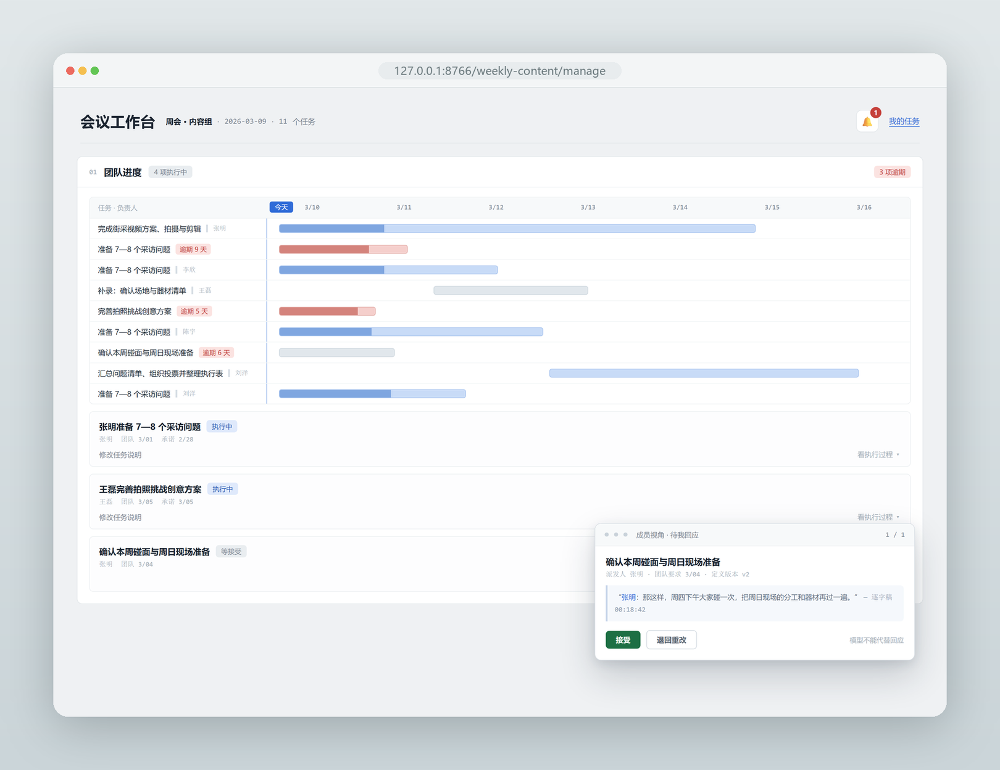
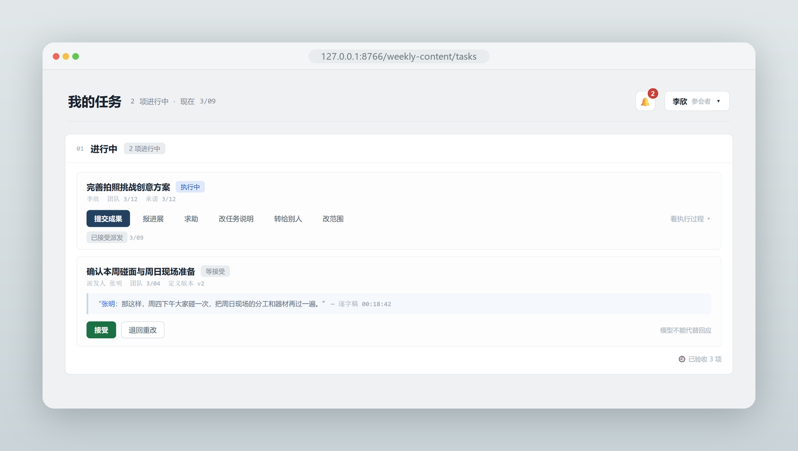
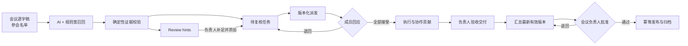
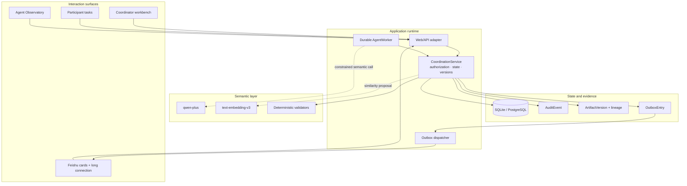
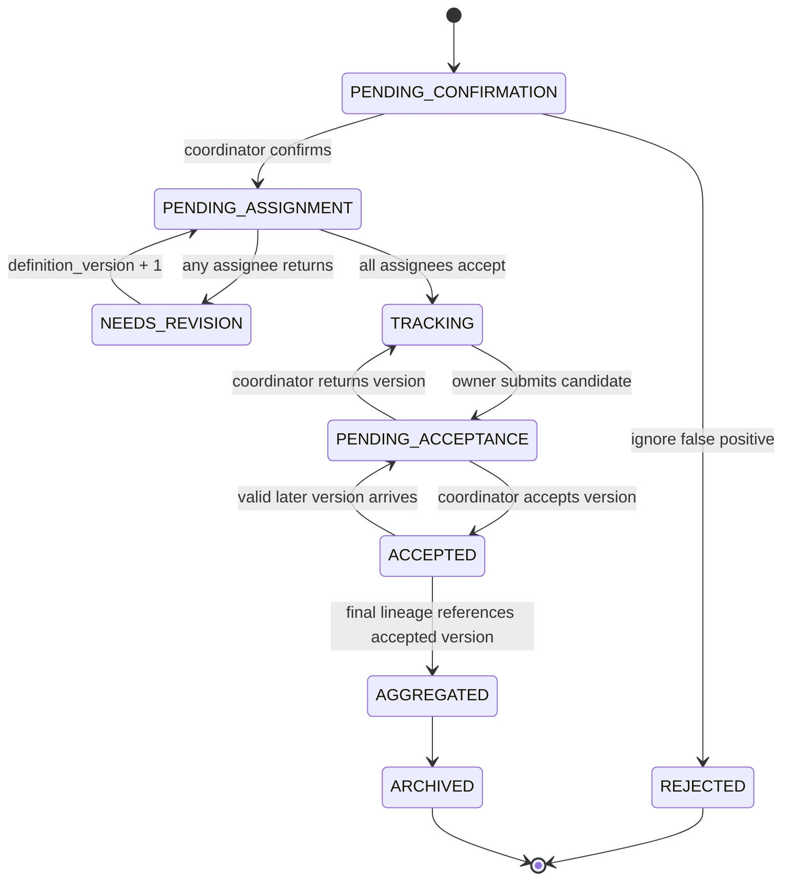
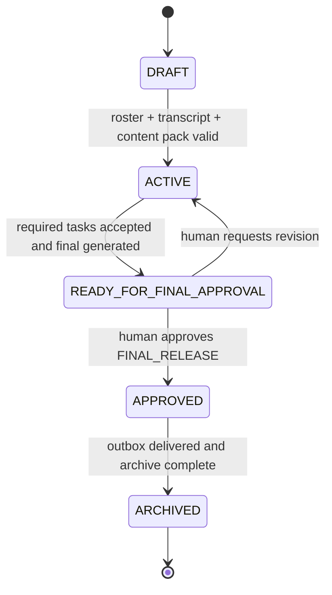
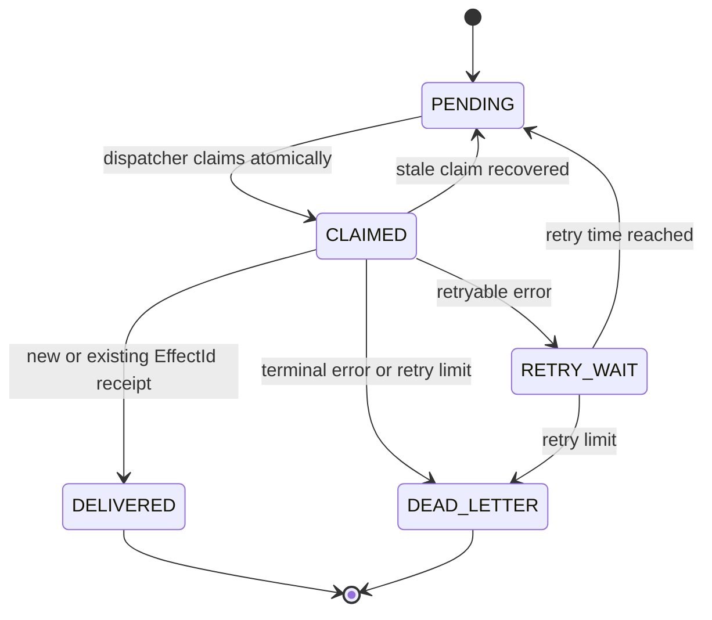

<div align="center">


# Meeting Action Coordinator

**把会议推进到可派发、提交、验收和归档的协作结果**

Recall-first · Human-gated · Versioned · Recoverable · Self-hosted

[](https://github.com/Wangyx163/colwork_agent/actions/workflows/tests.yml)


[](#-license)

[Quickstart](#-quickstart) · [How it works](#-how-it-works) · [API](#-workbench-api) · [Evaluation](#-evaluation) · [Design docs](docs/README.md)

</div>

<p align="center">
  
</p>

<p align="center"><sub>🧭 <b>负责人视角</b> · 在同一条会议协作链中查看团队进度、补录与派发任务、验收成果并批准终稿</sub></p>

---

## Why our project

大多数会议 AI 停在“总结发生了什么”。Meeting Action Coordinator 继续处理纪要之后真正发生的工作：

**会议决定会变成真正派到人手上的任务。** Agent 扫描逐字稿，找出会议中承诺、分配和决定要做的事情，并保留对应原文。会议负责人可以修改任务、补全交付要求，再把同一个定义版本派给负责人和协作者；每个被派发人都必须明确接受或退回，全部接受后任务才正式进入执行。

**所有人围绕同一个任务和同一条版本链协作。** 负责人、协作者和临时求助对象都在原 ActionItem 上提交内容，系统记录每次文本或办公文件交付的来源、作者、版本和处理结果。它也能运行“多人分别提交 → 一人汇总 → 全员投票 → 负责人定稿”这样的多步骤任务，而不是把一次会议拆成一堆失去关系的待办。

**Agent 会一直运行到成果被验收和发布。** 它持续读取数据库中的任务状态，跟进个人承诺、截止时间、延期、风险、求助、改派和范围变化；进程重启后可以从原状态继续。会议负责人验收每项工作的最新有效版本后，系统按版本来源生成终稿，经过最终人工批准，再发布和归档。

---

## ⚡ Quickstart

```powershell
git clone https://github.com/Wangyx163/colwork_agent.git
cd colwork_agent

python -m venv .venv
.\.venv\Scripts\Activate.ps1
python -m pip install -e .

# 使用仓库自带的演示数据启动会议协作工作台
python -m collab_agent serve
```

演示启动后直接打开：

- `http://127.0.0.1:8765/manage`：体验会议负责人复核、派发、验收和终稿流程。
- `http://127.0.0.1:8765/tasks`：切换到任务负责人或协作者视角处理自己的工作。

导入真实逐字稿、运行多会议控制台、连接百炼或飞书时，参见 [运行指南](docs/running.md)。

---

## 👥 Workspaces by role

| 角色                        | 看到什么                                                             | 可以完成的工作                                                                               |
| --------------------------- | -------------------------------------------------------------------- | -------------------------------------------------------------------------------------------- |
| 🧭 **会议负责人**           | 候选任务、待判断线索、全部任务进度、待验收版本和终稿                 | 补全任务定义，选择负责人和协作者，设置团队截止时间，派发任务，验收或退回交付，批准最终发布   |
| 👤 **任务负责人**           | 自己负责的任务、协作者贡献、当前承诺和历史版本                       | 接受或退回派发，承诺完成时间，更新进展与风险，发起求助或改派，处理协作贡献，提交最终候选版本 |
| 🤝 **协作者／临时求助对象** | 自己被邀请参与的任务及与本人有关的版本                               | 接受或退回协作，提交贡献版本，回应修改意见，报告风险或求助；不能替负责人验收任务             |
| 🔭 **系统管理员**           | Agent 运行记录、模型上下文、Token 消耗、外发结果、审计记录和版本来源 | 在 Observatory 中检查系统为什么采取某一步、是否恢复成功以及消息是否重复发送；不修改业务状态  |

<p align="center">
  
</p>

<p align="center"><sub>👤 参与者视角：只处理与自己有关的派发、协作和贡献；待回应事项集中出现，个人协作偏好由本人确认后再提供给同事。</sub></p>

---

## ✨ Key features

### 🎯 从逐字稿找回待办和不确定线索

Agent 从会议逐字稿中找出承诺、分工、截止时间和需要继续处理的决定，并保留对应原文。信息还不足以直接成为任务时，不会静默丢弃，而是作为 `review_hint` 留在负责人工作台。

### 📬 版本化派发与逐人回应

会议负责人补全交付物、验收标准、团队截止时间和参与人后再派发。任务负责人和每位协作者分别接受或退回同一个任务定义版本；有人退回时，负责人修改后生成新版本并重新派发。

### 🧭 承诺、进度、风险与求助持续跟进

成员可以给出个人承诺时间、更新进展、报告风险、请求帮助、提出改派或范围变化。Agent 根据当前状态决定下一步应提醒谁，而不是对所有人周期性群发同一条催办。

### 🤝 所有贡献留在同一个任务中

协作者和临时求助对象直接向原任务提交文本或办公文件。任务负责人可以采纳、要求修改或提升某个贡献为最终候选；来源、作者、版本和处理结果不会因为多人协作而丢失。

### 🗳️ 多步骤收集、汇总和投票

系统可以运行“多人分别提交 → 指定负责人汇总 → 指定成员投票 → 负责人定稿”的复合任务。每个阶段只有满足前置条件后才开放下一步，上游版本变化会使下游旧结果失效。

### 📦 从单项验收到会议终稿

任务负责人提交最终候选后，由会议负责人验收或退回。所有必需任务完成后，系统只汇总每项任务最新且已验收的版本，生成带来源链的终稿，并等待负责人最终批准。

### 🔗 跨会议延续未完成工作

新会议可以提议关联之前的行动项，用于识别延期任务、改述后的延续工作和已有交付。关联只作为建议，经过人确认后才进入正式关系。

---

## 🧩 How it works



模型、系统和人各自只做自己能够负责的事：

| 参与方        | 负责                                                                        | 不负责                                         |
| ------------- | --------------------------------------------------------------------------- | ---------------------------------------------- |
| 🧠 模型       | 候选发现、上下文证据整理、交付内容分析、跨会议语义关联建议、终稿组织        | 身份、权限、状态迁移、审批、催办等级、版本指针 |
| ⚙️ 确定性系统 | 引文与 ID 校验、权限、状态机、版本、Outbox、幂等、恢复、lineage、Token 账本 | 替人解释模糊业务意图                           |
| 👥 人         | 确认任务、接受或退回派发、处理贡献、验收交付物、批准终稿                    | 手工维护整条系统状态                           |

---

## 🏗️ Architecture



---

## 🔌 Workbench API

当前 HTTP 接口服务于仓库自带工作台和飞书适配器，已经有鉴权、角色检查、请求体上限与幂等键约束。

### Surfaces

| Route                    | Audience         | Purpose                                                |
| ------------------------ | ---------------- | ------------------------------------------------------ |
| `/{meeting_slug}/tasks`  | 当前会议参与者   | 查看和回应自己的任务、协作、求助、投票与提交           |
| `/{meeting_slug}/manage` | 会议负责人       | 复核候选和 hint、定义任务、派发、验收和终稿批准        |
| `/observatory`           | 持有运维令牌的人 | 查看 Agent run、Context、Token、Effect、审计和 lineage |
| `/api/meetings`          | 多会议入口       | 只返回会议 slug、标题和入口，不暴露会议内部状态        |

### Core endpoints

| Method | Endpoint                                     | Responsibility                                            |
| ------ | -------------------------------------------- | --------------------------------------------------------- |
| `POST` | `/api/session`                               | 为当前会议中的 actor 签发会话令牌                         |
| `GET`  | `/api/state?surface={surface}`               | 按 `tasks` 或 `manage` 角色投影状态；非负责人字段会被移除 |
| `POST` | `/api/action-items`                          | 负责人手工新增任务                                        |
| `POST` | `/api/review-hints/{hint_id}/materialize`    | 将 hint 补足并正式创建 ActionItem                         |
| `POST` | `/api/action-items/{id}/dispatch`            | 对当前任务定义版本执行派发                                |
| `POST` | `/api/action-items/{id}/assignment-response` | 被派发人接受或退回当前版本                                |
| `POST` | `/api/action-items/{id}/submit`              | 负责人或获得贡献权限的人提交版本                          |
| `POST` | `/api/artifact-versions/{id}/contribution`   | 负责人处理协作者贡献                                      |
| `POST` | `/api/artifact-versions/{id}/review`         | 会议负责人验收或退回交付版本                              |
| `POST` | `/api/final/generate`                        | 从最新有效版本生成带 lineage 的终稿候选                   |
| `POST` | `/api/approvals/{approval_id}`               | 批准或拒绝最终发布                                        |

写请求必须携带调用方生成的 `message_id` 作为幂等键。示意请求：

```bash
curl -X POST "http://127.0.0.1:8766/demo/api/review-hints/hint_123/materialize" \
  -H "Authorization: Bearer $SESSION_TOKEN" \
  -H "Content-Type: application/json" \
  -d '{
    "message_id": "ui-materialize-hint-001",
    "title": "整理客户问题清单",
    "deliverable": "一份去重后的客户问题清单",
    "acceptance_criteria": "每个问题包含来源和建议跟进人",
    "team_required_by_sim_time": "2026-03-06T18:00:00+08:00"
  }'
```

具体字段仍以 [接口契约](docs/design/08-interface-contracts.md) 和实现为准。

---

## 🔄 State machines

### ActionItem lifecycle



### Episode and final release



### Outbox delivery



完整状态、不变量和验证编号见 [State machines](docs/design/07-state-machines.md)。

---

## 🗂️ Project layout

```text
src/collab_agent/   Python 领域逻辑、Agent Worker、模型适配器与 Web API
web/                React + Vite + Tailwind 工作台与 Observatory
tests/              SQLite/PostgreSQL 共用的自动化测试
fixtures/           合成或匿名化的确定性演示数据
scripts/            开发、评测与演示入口
docs/               对外架构、评测、限制与开发说明
docs/design/        完整设计记录、历史实施计划与 ADR
capabilities.json   机器可读的当前能力与验证入口
```

### Development checks

```powershell
$env:PYTHONPATH = "src"
.\.venv\Scripts\python.exe -m unittest discover -s tests

cd web
npm.cmd test
npm.cmd run lint
npm.cmd run build
```

默认测试不调用外部模型。PostgreSQL 集成任务由 [GitHub Actions](.github/workflows/tests.yml) 提供数据库服务后运行。

---

## 📚 Documentation

- [Documentation map](docs/README.md)
- [Architecture and responsibility boundaries](docs/architecture.md)
- [Running the demo and real meetings](docs/running.md)
- [Evaluation protocol and results](docs/evaluation.md)
- [Known limitations](docs/known-limitations.md)
- [AI-assisted development](docs/ai-assisted-development.md)
- [Complete design record and ADRs](docs/design/00-README.md)
- [Machine-readable capabilities](capabilities.json)

---

## 📄 License

本仓库当前尚未选择开源许可证。代码公开用于项目评审，但“公开可见”不等于已经授权复制、修改或分发。确定授权方式后，应同时添加正式 `LICENSE` 文件并更新顶部徽章；在此之前不会仿照参考项目显示 Apache 2.0 或 MIT。
