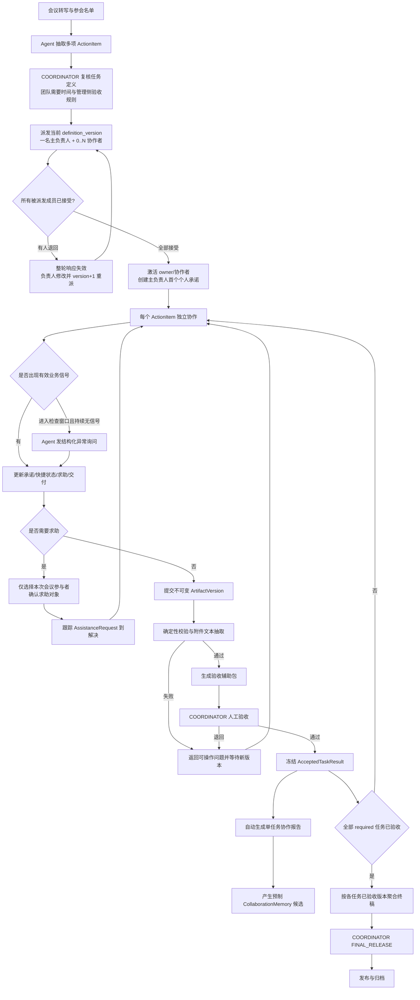

# 会议任务协作 Agent｜P0 业务链路、权限与上下文

版本：1.2  
变更依据：ADR-030、ADR-031、ADR-035

## 1. 业务边界

P0 处理一场会议及其产生的多项任务：会议负责人复核任务并版本化派发给一名主负责人和必要协作者，参会者逐人回应后在同一任务内完成，系统主动追踪异常、组织单任务成果，会议负责人验收并最终放行。未参会同事、直属上级、组织级通讯录管理和跨会议长期协作均不进入当前主链。

为避免术语冲突：`COORDINATOR` 是会议负责人兼任务发起/验收人；`ActionItem.owner_actor_id` 指任务的协作执行人，不代表会议负责人。

## 2. 业务链路图

## 3. 必要权限矩阵

| 对象/动作 | COORDINATOR | PARTICIPANT | SYSTEM |
|---|---|---|---|
| 参会名单、团队工期 | 全量可见 | 仅本人任务关系/时间线与会议聚合 | 按任务推进 purpose 读取 |
| 任务定义与 `team_required_by` | 创建/修改/派发 | 被派发或同任务时可见 | 不得自行修改 |
| `management_review_policy` | 可见/修改 | 不可见 | 仅处理验收包时可读 |
| 派发回应与 `promised_by` | 配置成员/查看回应 | 仅本人接受或退回；owner 仅修订自己的个人承诺 | 不得代替回应或承诺 |
| 快捷状态与进展信号 | 可查看任务级摘要 | 仅本人任务写入 | 可记录/计算，不得伪造人类信号 |
| 求助 | 可接收/响应 | 仅向本次参会者发起 | 可推荐，不可代替选择 |
| 提交 | 可查看 | 仅任务执行人提交 | 可校验/抽取/处理 |
| 业务验收与退回 | 决定 | 查看本人反馈 | 只生成辅助信息 |
| 协作 Memory | 只见任务事实，不见完整 Memory | 本人维护；当前协作者只读 CONFIRMED 最小提示 | 按明确 purpose 写候选/构建提示 |
| 终稿放行 | 决定 | 只见发布结果 | 未批准不得外发 |

服务端必须先根据可信 Principal 判断身份，再执行业务动作和字段裁剪。前端隐藏字段不构成权限控制。

## 4. 上下文分层

| 上下文层 | 内容 | 使用者 | 规则 |
|---|---|---|---|
| Episode Context | 会议转写证据、参会名单、任务集合 | 抽取与协调 | 只绑定当前 Episode |
| Task Context | 任务定义、两类日期、当前承诺、有效版本、求助与反馈 | 单任务 Agent 调用 | 不把其他任务正文默认混入 |
| Access Context | principal、角色、membership、purpose、字段 allowlist | 所有服务/模型调用 | 系统代码强制 |
| Processing Context | 标题、正文、链接元数据、附件抽取文本、验收标准 | 单任务成果处理 | 分层标注来源并绑定 version_id |
| Memory Context | 已确认预制协作习惯及版本 | 后续协作提示 | 本人维护；当前协作者只读最小提示；不得用于权限决定 |

标题是任务语义和验收目标，提交正文/附件是执行结果，二者不能直接拼成一段无来源文本。模型输入必须保留 `task_definition`、`submission_text`、`link_metadata`、`attachment_extractions[]` 与 `source_manifest` 的分层结构。

## 5. P0 接口边界

- 代码枚举：`PrincipalRole = COORDINATOR | PARTICIPANT | SYSTEM`；领域动作使用 `REVIEW_TASK | DISPATCH_TASK | RESPOND_ASSIGNMENT | REVISE_PROMISE | RECORD_SIGNAL | REQUEST_HELP | SUBMIT_VERSION | REVIEW_VERSION | RELEASE_FINAL | READ_MEMORY | REPLACE_MEMORY`，禁止用页面名称代替授权动作。旧 `PUBLISH_TASK/CLAIM_TASK` 仅用于兼容回归，不暴露在新 Web API。
- 资源归属检查统一使用 `episode_id`、`action_item_id`、`owner_actor_id` 和 EpisodeParticipant；兼容层可把旧 `AGGREGATOR/ACTION_OWNER` 映射到新角色，但新业务代码不得继续扩散旧名称。
- `PrincipalProvider.resolve(request) -> Principal`：P0 签名虚拟会话，P2 飞书身份适配。
- `AuthorizationService.require(principal, action, resource)`：校验角色、Episode membership、任务归属。
- `ProjectionService.project(principal, purpose, resource)`：服务端字段裁剪。
- `SignalService.record/derive`：记录 allowlist 信号，计算最后有效信号与过期。
- `AssistanceService.request/respond/resolve`：目标必须是本 EpisodeParticipant。
- `TaskResultProcessor.process(version_id)`：读取单任务分层输入，输出版本绑定的验收辅助包。
- `MemoryService.propose/confirm/replace/reject`：协作报告只能从版本化预制词表生成候选，不能写自由文本或评价人格结论。

这些是代码模块边界，不要求拆成微服务，也不引入 LangGraph、通用 Router 或额外工作流实体。

## 6. 当前不做但保留的适配点

- 飞书 `external_user_id -> actor_id` 映射、群聊/卡片回调与平台权限校验；
- 未参会成员的任务外包、直属上级 L3、完整组织 RBAC；
- 跨 Episode Memory 汇总、冲突、衰减与撤回；
- 完整任务依赖图和跨会议多 Episode 并发。

P1 只加入同一 Episode 内“多人收集问题 → Agent 整理候选 → 指定成员投票 → 一名负责人定稿”一个白名单结构；不改变上述“完整依赖图和跨会议编排不做”的边界。
