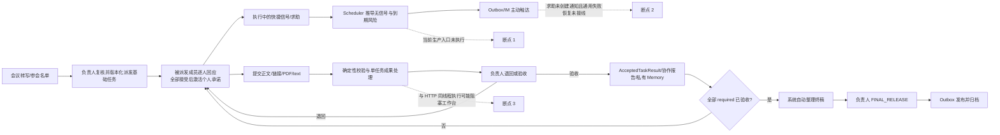

# P0 基础任务闭环审计与后续 Agent 路由

状态：HISTORICAL；生产化缺口审计，范围已由 ADR-033 收缩  
日期：2026-08-06  
审计范围：基础 ActionItem 从会议进入到发布归档的业务、运行、权限、上下文、失败恢复与验收链路  
不纳入：ADR-031 已降至 P1 的多人收集、顺序交接和多人决策结构

## 1. 结论

- 业务语义链已经闭合：抽取/复核 → 版本化派发/逐人响应/承诺 → 信号/求助 → 独立交付 → 处理/人工验收 → 报告/Memory → 自动终稿 → FINAL_RELEASE → 归档。
- 自动化测试覆盖的领域链已通过，但生产工作台的运行链尚未闭合，因此当前不能宣称 P0 完成。
- 缺口主要不在新增业务实体，而在已有 Scheduler、Worker、Dispatcher、AssistanceRequest 和 OutboxEntry 没有被生产运行入口完整组织起来。
- 修复下列 P0 阻断项后，再进行一次不调用测试辅助方法的真实运行验收，才进入用户最终检查。

## 2. 当前业务链与断点

## 3. P0 阻断项

| 优先级 | 缺口 | 代码/规范证据 | 直接结果 | 最小修复，不新增业务实体 | 验收信号 |
|---|---|---|---|---|---|
| P0-A | 生产业务时间不推进，策略不自动评估 | meeting 导入只初始化一次 `current_sim_time`；`serve_dashboard` 的循环只处理成果和终稿，没有调用 `advance_time/evaluate_policy/dispatch_all`；N04/N14 要求主动询问 | 工作台开着也不会按实际时间追交付 | 在现有 N14 增加 `ClockSource` 运行接口：评测用 VirtualClock，真实工作台用单调的 SystemClock；Worker 每 Tick 同步时间并调用现有策略 | 不直接调用 service 测试方法，工作台运行后能自动产生且只产生一次到期询问 |
| P0-B | 模型处理与 HTTP 请求处于同一串行循环 | `web.py::process_ready_results` 在 `handle_request` 前同步调用百炼/终稿整理 | 模型慢或网络抖动时页面会 `Failed to fetch`，用户无法继续操作 | 保持模块化单体，但把持久化 Worker 与 HTTP Server 分成独立运行循环/进程，各自使用数据库连接；不用 Celery/Redis | 注入 60 秒慢模型时，`/api/state` 与普通提交仍可响应；Worker 恢复后继续同一版本 |
| P0-C | 求助只落库，不主动通知目标人 | `request_assistance` 只写 AssistanceRequest、AuditEvent 和信号，未写 OutboxEntry；API-HELP-001 也未冻结通知语义 | 求助对象只有主动打开/刷新页面才知道被求助 | 复用 AssistanceRequest、OutboxEntry、AuditEvent；创建、确认、解决、取消使用稳定 EffectId 通知对应当事人 | 每次状态变化只产生一条正确收件人的 mock IM；重复请求不重复发送 |
| P0-D | 通用 Outbox 失败与启动恢复没有进入生产闭环 | `dispatch_all` 对 `im.send` 没有通用异常转 RETRY_WAIT/DEAD_LETTER；工作台启动不调用 `recover_dispatcher`；N09 已要求这两项 | 接受前故障可把 entry 长期留在 CLAIMED；重启后也不会主动恢复/派送 | 在现有 N09/Outbox 状态机内补异常分类、重试上限、启动回收与可见失败；不另建队列实体 | 接受前失败、接受后响应丢失、重试耗尽、进程重启四类测试全部可判定且无重复外发 |
| P0-E | 缺少“部署入口级”闭环验收 | 78 个自动测试通过，但策略/时钟多由测试或 evaluation 直接调用；runtime smoke 没有覆盖真实时钟主动触发和 Worker 重启 | 测试绿不等于用户实际运行链路闭合 | 增加 Live E2E：只通过 HTTP、数据库与进程启停驱动，不直接调用领域 service 方法 | 会议导入到归档全链通过，5 GATE 保持通过，并新增运行时响应、主动触达和恢复证据 |
| P0-F | 附件大小只由浏览器校验 | 前端限制附件总计 5MB；服务端按 Content-Length 全量读取，附件解析层没有原始字节上限 | 绕过页面可提交超大 base64 请求并阻塞/耗尽内存 | 在 HTTP 入口和附件解码前做服务端上限与稳定 413/VALIDATION 错误；继续只支持 PDF/text | 超限请求在解码和模型调用前失败，领域状态不变并有可定位错误 |

## 4. 已闭合且不应重做的部分

- 组织/角色：P0 只保留 COORDINATOR、PARTICIPANT、SYSTEM 和工程评测者；不增加普通团队成员、直属上级或组织管理员。
- 权限：签名虚拟 Principal、Episode membership、角色/owner 校验与字段 projection 已有自动测试；真实飞书身份仍按既定计划后置。
- 任务模型：单 owner、不可变承诺修订、双工期、ArtifactVersion、AcceptedTaskResult、终稿 lineage 已成立。
- 成果处理：标题/任务契约、提交声明、正文、链接和附件抽取文本分层；附件二进制不发送模型。
- 人工边界：SYSTEM 不代替派发回应、求助对象选择、单任务验收或 FINAL_RELEASE。
- P1 协作结构：复用基础 ActionItem 与最小依赖/参与关系，不新增 Workflow、Stage、LangGraph 或第二套状态机。

## 5. 结构与组织补位

这里需要补的是运行职责，不是业务角色或领域实体：

| 运行职责 | 只负责 | 不负责 |
|---|---|---|
| Web/API | 鉴权、字段投影、接收业务命令、查询状态 | 跑模型、推进时间、决定提醒 |
| Worker | 同步业务时间、处理待处理版本、排队终稿、调用确定性策略 | 修改人工决定、伪造业务输入 |
| Dispatcher | 原子领取 Outbox、调用 IM Adapter、记录回执/重试/死信 | 重新决定是否应该发送 |
| Model/Skill Adapter | 按 purpose 和 allowlist 处理版本绑定上下文 | 改 owner、状态、权限、验收或发布决定 |

四种职责可以在同一代码库部署，但必须共享 PostgreSQL 事实源并保持运行循环隔离。P0 不需要增加 Redis、消息中间件或工作流框架。

## 6. Luna 路由结论

如果“Luna”指轻量级编码 Agent，则不能把剩余工作整体交给它；应按失败代价路由：

| 工作 | Luna | 原因/边界 |
|---|---|---|
| 文档同步、编号检查、链接/版本号修复 | 可以 | 机械、局部、结果易校验 |
| 已冻结契约后的 UI 文案、状态展示、服务端大小校验 | 可以 | 影响面有限，配套测试可形成明确 oracle |
| 按既定模板补 unit/contract fixture | 可以 | 只扩覆盖，不设计新状态语义 |
| P0-A 真实钟、Worker 调度顺序与并发隔离 | 不建议 | 涉及时序、并发、重启和重复副作用 |
| P0-C/D 求助通知、Outbox 重试/死信/恢复的首次实现 | 不建议 | 一旦错误会漏发、重发或卡死业务链；契约稳定后可让轻量 Agent 补边界测试 |
| P0-E Live E2E 的场景设计和最终裁决 | 不建议 | 它决定“测试绿是否等于产品闭环” |
| P1 协作结构的首次领域设计 | 不建议 | 涉及依赖、版本失效、权限和上下文边界；结构冻结后，简单 UI/fixture 可交给 Luna |

当前工作区直接可调用的模型档位没有 Luna，因此这里先作为后续任务路由规则，而不是当前可执行的模型切换。

## 7. 建议执行顺序

1. P0-A + P0-B：先形成真实可运行的 Clock/Worker 主循环，并保持 HTTP 不阻塞。
2. P0-C + P0-D：把求助和追交付全部纳入同一 Outbox 投递/恢复机制。
3. P0-E：建立不调用 service 辅助方法的 Live E2E 和进程恢复测试。
4. P0-F：补服务端请求上限、错误投影与相应测试。
5. 用户按真实会议做一次角色切换、求助、提交、退回、重交、终稿驳回/放行验收。
6. P0 Gate 通过后，才启动 ADR-031 的 P1 协作结构。

## 8. 评审结论

当前判定：`NOT READY FOR P0 SIGN-OFF`。  
原因不是业务模型缺失，而是自动追交付、求助通知、运行隔离和恢复尚未在真实工作台入口闭合。修复范围集中在现有组件组织和测试入口，预计不需要新增业务实体或引入工作流框架。
