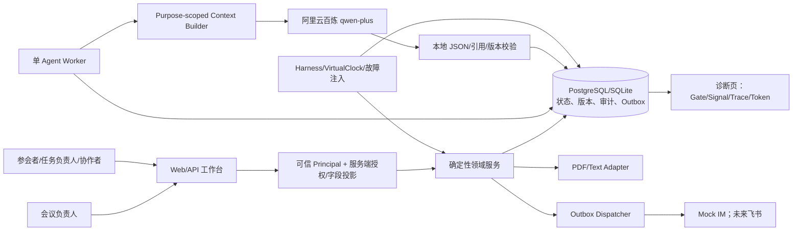
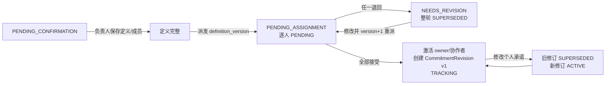
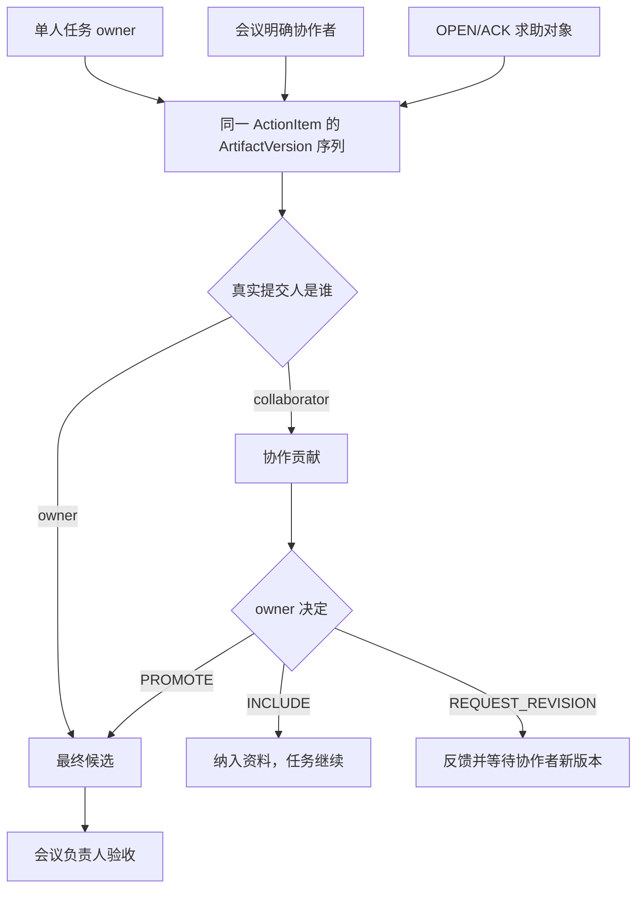
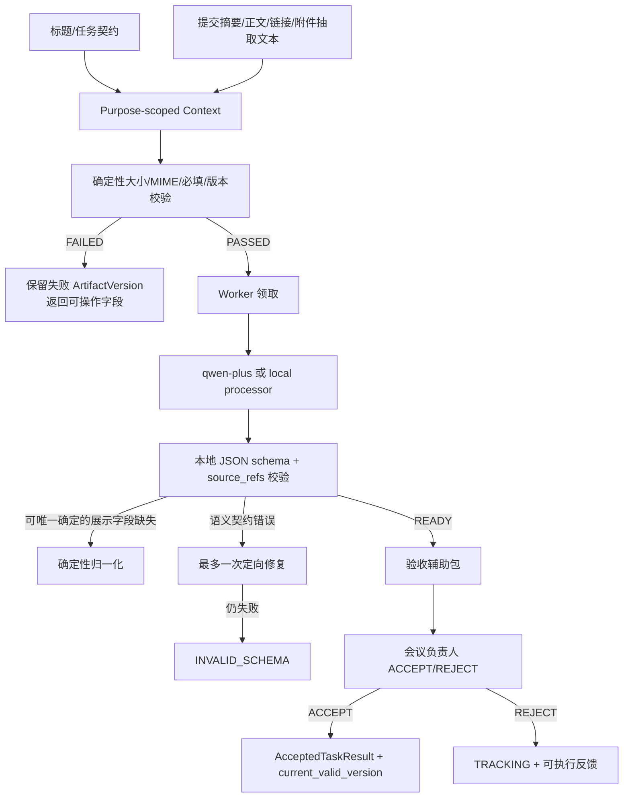
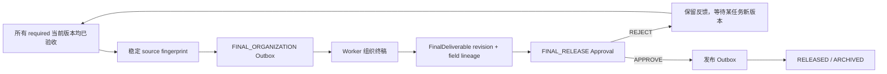
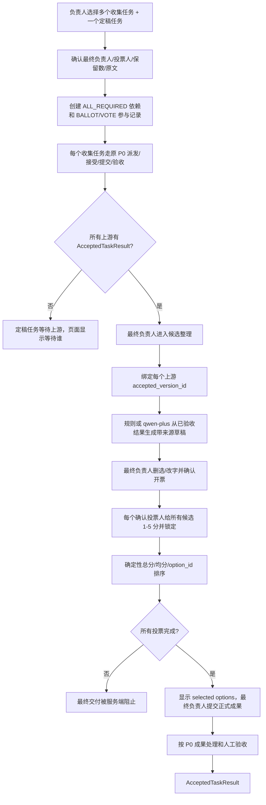

# 办公协作 Agent｜当前实现与目标链路全景图

版本：0.2（P0/P1 工程冻结稿，评测除外）  
日期：2026-08-07  
审计对象：当前 SDD、`src/collab_agent`、Web 工作台、SQLite/PostgreSQL DDL、自动化测试与 AI-P0 Harness  
状态口径：本文严格区分“代码存在”“自动化通过”“真实工作台已验证”“未来设想”，不把其中一种代替另一种。

## 0. 先给结论

这个项目当前最准确的定义是：

> 一个会议任务协作 Agent：它把逐字稿变成可确认的任务，用确定性状态机、版本和权限推进每个同事的工作，用大模型处理语义抽取与成果整理，把关键决定留给人，并在进程中断后从数据库继续。

当前方向总体成立，而且 AI 工程主线比较集中：`结构化事实抽取 + 单 Agent 长程 Loop + LLM/确定性规则混合 + HITL + 状态外置 + version lineage + 幂等恢复 + Context/Token Manifest + Harness`。

但必须同时承认四个边界：

1. **P0 面试版代码闭环已成立**：当前 102 项自动化测试通过，另 1 项 PostgreSQL 集成测试因本次未提供测试连接而跳过；已有离线 Harness 和真实百炼契约烟测。
2. **P0 单任务真实业务链已经跑通**：负责人/协作者提交、贡献处理、模型辅助、会议负责人验收、AcceptedTaskResult、协作报告和 Memory 均有实现。
3. **“追着交付”目前主要是可复现规则能力，不是墙上时间生产服务**：VirtualClock、L1/L2 规则、EffectId 和 Outbox 逻辑存在，但真实工作台 Worker 不自动同步现实时间，也不自动运行完整催办/通知循环；页面刷新也不会触发催办。
4. **P1 问题收集—投票—定稿与 Memory 工程规则已冻结，尚待真人 UI 验证**：候选自动整理、上游人工验收 Gate、来源 lineage、ballot/投票锁定、确定性计分、上游换版失效和最小 Memory 提示已有实现与自动化测试；本轮明确不做最终有效性评测。

### 0.1 当前完成状态总表

| 范围 | 当前状态 | 可以宣称什么 | 不能宣称什么 |
|---|---|---|---|
| P0 单任务闭环 | 已实现、已测试、真实样例跑通 | 单任务从版本化派发/响应到验收结果冻结闭环 | 不能说所有外部办公平台已接入 |
| P0 多同事协作贡献 | 已实现、已测试、真实链路已跑 | 协作者复用同一任务和版本链，负责人决定如何采用 | 不能说多人共同 owner 或自动替负责人定稿 |
| P0 多任务终稿 | 代码与 Harness 已闭合 | 全部 required 任务验收后自动组织终稿并走 FINAL_RELEASE | 当前用户定义的 P0 不要求真实会议全部任务都完成；真实会议全量签收未完成 |
| P0 主动追交付 | 规则/Harness 已实现 | 能用业务事件、VirtualClock 和确定性规则复现实验 | 不能说系统会按现实时间在飞书里自动催办 |
| P0 权限/上下文 | 已实现虚拟身份和字段投影 | 服务端角色、membership、owner、purpose、allowlist 有测试 | 不能说已完成企业 IAM/RBAC 或飞书权限打通 |
| P1 问题收集—投票—定稿 | 规则、代码和自动化完成，待真人 UI 验收 | 上游验收 Gate、Agent 草稿、来源 lineage、锁定投票、确定性计分、最终提交 Gate、上游换版失效均能跑 | 不支持缺席/弃权/改票/quorum，也未做效果评测 |
| P1 Memory 注入 | 预制词表、本人维护、Agent Context 与当前协作者最小提示完成 | 只装配 CONFIRMED Memory，跨人不返回证据/历史，按 Token 预算裁剪 | 不能说已做跨 Episode 衰减、冲突与撤回 |
| P1 上下文缓存 | 已从新建/迁移 DDL 移除 | 当前依靠版本状态、幂等 receipt 与目的化 Context 避免重复处理 | 不能宣称有缓存命中或 Token 收益 |
| 最终有效性评测 | 工程 Harness 已有，产品效果评测未做 | 能证明状态、恢复、lineage、权限和预算 Gate | 当前 2 条自填 expected=prediction 的抽取样例不能证明 Agent 有效性 |

## 1. 系统总图：人、Agent、规则、模型和数据各负责什么



### 1.1 边界原则

| 决策类型 | 权威执行者 | 原因 |
|---|---|---|
| 身份、membership、owner、权限 | 确定性系统 | Prompt/temperature 不能成为权限系统 |
| 任务状态、承诺修订、版本指针 | 确定性系统 + 数据库事务 | 必须可恢复、可并发检查、可审计 |
| 行动项语义抽取、成果语义整理 | LLM Prompt | 需要理解自然语言和整理表达 |
| PDF/text 读取 | 明确 Adapter | 属于格式工具，不应塞进 Prompt |
| 是否催办、催办等级、预算 | 确定性规则 | 需要稳定、可解释、可复算 |
| 派发回应、求助对象、验收、终稿放行 | 人工 Gate | Agent 提示不能替代业务责任人 |
| 投票计分 | 确定性规则 | 同样输入必须可重算 |
| Memory 候选确认/同 topic 替换/拒绝 | Memory 本人 | 值来自预制词表，避免把系统推断变成评价标签 |

## 2. 三个页面的完整信息架构

### 2.1 `/tasks`：参会者工作台

```text
┌ 顶栏 ──────────────────────────────────────────────────────┐
│ 同事任务 | 负责人(有权限才显示) | 诊断(有权限才显示)       │
│ 待回应派发闹铃 | 虚拟身份切换                              │
└────────────────────────────────────────────────────────────┘
┌ 我负责/协作中的任务时间线 ────────────────────────────────┐
│ 蓝色=我负责 / 紫色=我协作 / 进度条 / 团队需要时间          │
│ 点击任务外框高亮，其他任务变淡，下方切换当前执行区          │
└────────────────────────────────────────────────────────────┘
┌ 我参与过的任务 ┐ 协作结束后保留自己的历史只读跟踪
┌ 我的协作 Memory ┐ PRIVATE_DRAFT / CONFIRMED 的确认、预制词替换、拒绝
```

每张任务卡按状态组合以下功能块：

| 功能块 | 何时显示 | 实现思路 |
|---|---|---|
| 任务头 | 始终 | 标题、状态、负责人、两类日期、任务来源、SOLO/协作标识 |
| 复合协作进度 | P1 结构任务 | 上游完成数、投票数、等待对象、最终提交是否解锁 |
| 求助状态 | 存在 AssistanceRequest | requester/target/status 与 ACK/RESOLVE/CANCEL 动作 |
| AI 处理回执 | 已提交版本 | PENDING/PROCESSING/READY/RETRY_WAIT/FAILED、错误码和阶段 |
| 校验失败提示 | 最新版本 FAILED | 保留失败版本和表单草稿，显示可操作缺失项 |
| 协作贡献列表 | owner 查看 | 真实提交人、版本、校验/分析结果、INCLUDE/REQUEST_REVISION/PROMOTE |
| 协作记录 | 负责/协作/曾协作 | 承诺、快捷信号、求助、贡献、处理决定、验收按 AuditEvent 排序 |
| 快捷状态 | TRACKING 且本人可贡献 | 按计划/有风险/阻塞/等待输入/准备提交；说明可选 |
| 求助 | TRACKING 且无进行中求助 | 只能选择本次会议参与者；类别 + 需要什么帮助 |
| 个人承诺修改 | 仅 task owner | 新 CommitmentRevision，不覆盖团队需要时间 |
| 提交成果 | owner 或当前协作者 | 摘要必填；正文/链接/附件至少一项；协作者提交不结束任务 |

页面更新规则：首次进入及提交/确认成功后重新渲染；没有手动刷新按钮，也没有 `setInterval` 高频刷新。文本草稿写入浏览器 localStorage，文件选择无法跨整页重启恢复。

### 2.2 `/manage`：会议负责人工作台

```text
1. P1 复合协作结构确认（当前新增的第一版）
2. 提取结果复核、成员配置与版本化派发
3. 交付验收
4. 终稿汇总/处理失败
5. 执行概览与协作贡献
6. FINAL_RELEASE 批准/驳回
```

| 页面功能块 | 当前动作 | 后台约束 |
|---|---|---|
| P1 复合协作 | 选择定稿任务、上游任务、最终负责人、投票人、保留数、会议原文 | 只能在定稿任务首次派发前确认；成员必须在本 Episode；依赖无环 |
| 任务复核卡 | 修改标题、交付物、工作要求、管理验收规则、团队日期、优先级，配置一名主负责人和 0..N 协作者 | source span 不可被覆盖；字段/成员完整后才能派发 |
| 合并/忽略 | 合并重复任务或忽略误抽取 | 原始证据与审计保留，不删除历史 |
| 待验收卡 | 查看真实提交人、原始声明、附件抽取、AI 辅助、编辑完成报告 | 只有最终候选进入；协作贡献必须先由 task owner 处理 |
| 验收通过/退回 | 冻结 AcceptedTaskResult 或回到 TRACKING | AI 只能建议，不能调用人工验收状态迁移 |
| 终稿卡 | 查看 organized_report、原始交付和 lineage | 所有 required 当前有效结果齐备后 Worker 自动组织 |
| FINAL_RELEASE | 批准发布或带反馈驳回 | 批准前再次核对当前版本、AcceptedTaskResult 和 lineage |

### 2.3 `/diagnostics`：工程和面试展示页

| 功能块 | 当前展示 |
|---|---|
| 5 个 Gate | E2E、零重复外发、版本/lineage、权限护栏、恢复 |
| Context/Token Trace | purpose、模型、估算/实际 Token、included/omitted refs、输出状态 |
| Flow/Effect/Node Signals | 流程漏斗、工期、信号、询问、求助、身份、处理、Memory、Outbox |
| 全局审计时间线 | sequence、event type、aggregate、sim time |

它不是业务页面，不应向普通参与者暴露；参与者 projection 会清空全局 report、timeline 和 Agent trace。

### 2.4 当前缺少的页面入口

- 没有“新建会议/上传逐字稿”产品页；真实会议目前用 CLI 抽取，再通过启动参数载入。
- 没有真实组织成员管理页；参会名单由启动配置显式提供。
- 没有生产归档下载页；归档数据仍在同一数据库中。
- 没有飞书卡片；当前身份是签名虚拟会话。

这些缺口符合面试项目收缩后的范围，但如果目标重新变回生产系统，它们会成为明确的产品化工作包。

## 3. 闭环 A：会议逐字稿 → 待复核任务

### 3.1 用户看到什么

- 当前没有上传页；用户运行 `python -m collab_agent extract`。
- 抽取成功后，负责人在 `/manage` 的“任务复核、修改与派发”看到每个任务卡。
- 卡片显示任务标题、交付物、工作要求、管理侧验收规则、团队时间、原文时间戳和引文。

### 3.2 后台具体步骤

1. `BailianExtractor` 按完整发言轮次切分长逐字稿，保留少量上下文重叠。
2. qwen-plus 只输出结构化候选：title、deliverable、owner/deadline candidate、source timestamp/quote、confidence、uncertainties。
3. 本地 schema 校验和 fail-closed 归一化处理可空字段矛盾。
4. 本地原文对齐校验 timestamp/quote；唯一证据可确定性修正。
5. 仍不对齐时最多一次“只修证据字段”的模型修复，不允许改变任务语义。
6. 每个 chunk 以 transcript hash、Prompt 版本、模型、chunk hash 写检查点；中断只重跑缺失 chunk。
7. 去重后导入同一张 `action_items`，状态为 `PENDING_CONFIRMATION`；不建 Candidate 实体。

### 3.3 AI/规则边界

| AI | 确定性系统 | 人 |
|---|---|---|
| 理解任务语义、抽取候选 | schema、引用对齐、身份/协作者证据规则、去重、checkpoint | 负责人修改、合并、忽略、配置成员并派发 |

### 3.4 当前风险与未来

- 当前结构抽取效果 Harness 只有 2 个自填样例，不能证明真实会议泛化能力。
- P1 复合结构还不是从逐字稿自动提出；目前负责人手动选择任务和粘贴会议依据。
- 未来应先增加 3–5 份真实会议盲测，而不是建设大训练集。

## 4. 闭环 B：复核/版本化派发 → 逐人响应 → 双工期



### 页面/功能块

- `/manage` 任务复核卡：团队需要时间、主负责人、协作者和派发留言由负责人设置。
- `/tasks` 右上闹铃：被派发人逐人接受或带留言退回重改。
- `/tasks` 个人时间线：只显示本人负责/协作任务；同任务成员关系可见，其他人的个人承诺/进展/正文不可见。
- `/tasks` 当前任务执行区：只有 owner 能修改自己的个人承诺。

### 实现细节

- 每个当前 definition_version 恰有一个 OWNER assignment 和 0..N COLLABORATOR assignment；所有 actor 必须是显式 EpisodeParticipant。
- 任一人退回时，ActionItem=NEEDS_REVISION，同轮其余 PENDING/ACCEPTED assignment=SUPERSEDED；修改后 version+1 并重新派发，所有成员重新回应。
- 全部成员接受时原子写 owner、激活协作者、首个 ACTIVE CommitmentRevision、ActionItem=TRACKING、AuditEvent 和 inbound receipt；首个个人承诺暂取团队需要时间，owner 可随后如实修订。
- 个人承诺晚于团队需要时间仍保存真实承诺，并写 `ScheduleConflictDetected`；不会偷偷修改团队日期。
- 请求使用 message_id 幂等；CommitmentRevision 不可覆盖。
- P1 定稿任务的 assigned owner 必须等于结构中确认的最终负责人；ballot 草稿仍必须等所有上游验收完成。

### 当前技术命名

- UI 已明确提示“个人承诺已更新；团队需要时间未改变”。`request_deadline_change` 是历史函数名，实际语义不是 Approval；它不影响业务闭环，后续只做内部重命名，不新增实体。

## 5. 闭环 C：任务推进、快捷信号与求助

### 页面/功能块

- 快捷状态：按计划、有风险、被阻塞、等待输入、准备提交。
- 补充说明：可选，不强制写“进展/下一步/阻塞”长表单。
- 求助：选择本次参会者、类别、需要什么帮助。
- 求助对象：ACKNOWLEDGE、RESOLVE；发起人可 CANCEL。
- 协作记录：所有状态、求助生命周期和协作者行为进入同一任务时间线。

### 系统如何判断“没有信号”

系统不判断用户有没有打开页面，而只看以下业务事件：派发接受/改期、快捷状态、求助状态、版本提交、返工回应。每个快捷信号有 `valid_until`；过期后不再证明当前状态。

确定性催办条件包括：任务仍 TRACKING、没有待验收/有效版本、进入承诺前检查窗口或已逾期、持续无有效信号、没有未解决求助、冷却期和当日预算允许。

### 当前真实运行边界

- 规则、Intervention、EffectId、触达预算和 VirtualClock 已在 Harness/测试中可复现。
- 当前 `AgentWorker.run_once()` 只处理任务成果和终稿，不同步现实时间，也不自动执行完整 `evaluate_policy + dispatch_all`。
- 求助目前落库并在工作台显示，不保证通过外部 IM 主动通知对方。
- 因此当前能力准确叫“可复现主动协调策略”，不能叫“已上线的现实时间催办服务”。

### 5.1 事件驱动通知 ≠ 策略驱动催办（已实现）

两者都经 Outbox，但来源和可抑制性完全不同，必须分开：

| | 事件驱动通知 | 策略驱动催办 |
|---|---|---|
| 触发 | 业务事件发生（派发、开票、验收、求助） | `evaluate_policy()` 判定长期无信号 |
| 创建点 | 领域方法内直接 `_notify()` | `_plan_intervention()` |
| 可否抑制 | **不可**，必须送达 | 可，受每日触达预算与冷却期约束 |
| 依赖 VirtualClock | 否 | 是 |

已实现的四类通知 effect_type：`ASSIGNMENT_RESPONSE_REQUIRED`、`VOTE_REQUIRED`、`REVIEW_DECIDED`、`ASSISTANCE_REQUESTED`。

EffectId 由业务触发键派生（如 `action_item_id:v2`、`ballot:contribution_id`），因此重放同一业务动作会收敛到同一条 outbox 行，不会二次发送。

### 5.2 通知载荷契约 `notification.v1`

`OutboxEntry.payload` 在原有 `content`（纯文本）之外增加可选 `notification` 对象。纯文本适配器（MockIM）继续读 `content`，卡片适配器读 `notification`——**两种传输都不需要解析散文来决定画什么按钮**。

```
notification.v1
  kind                任一通知 effect_type
  action_item_id      绑定的任务
  title / summary     卡片标题与正文
  fields[]            {label, value} 只读展示
  decisions[]         可内联作出的决定
    name              入站动作名，服务端据此分派
    label             按钮文案
    requires_reason   true 时卡片必须收集理由
    score_options[]   仅投票用，逐候选打分
  deep_link_path      回工作台的路径
```

**`decisions` 为空表示这条通知只是信息**（如验收结论），后续动作必须回工作台完成。判据是：**该决定是否需要阅读交付物本身**——需要就不能内联。

### 未来选择

- 面试项目：保留现状，用 VirtualClock 演示规则、幂等和恢复，成本最低。
- 生产化：增加 SystemClock/Scheduler Worker、安静时段和消息合并；这会新增运行职责，但不需要新业务状态机。飞书消息通道已由 Outbox 承载（`agent-meeting --notify feishu`）。

## 6. 闭环 D：单人任务与协作任务共用一套交付链



### 为什么没有第二套协作系统

- 协作者不拥有另一条任务状态机。
- 交付都写 `ArtifactVersion`，用 `submitted_by_actor_id + contributor_role` 区分语义。
- 协作状态从版本和 AuditEvent 推导为 AWAITING_OWNER/INCLUDED/REVISION_REQUESTED/PROMOTED。
- 负责人处理贡献只产生业务决定，不建立子任务、共同 owner 或 CollaborationDelivery 实体。

### 页面实现

- `/tasks` 分“我负责的任务”“我协作的任务”“我参与过的任务”。
- 协作者得到与 owner 相同的快捷状态、求助和提交空间，但没有改 owner 承诺和人工验收权。
- 协作提交按钮明确提示“不会结束整项任务”。
- owner 在原任务卡处理每个贡献版本。
- 会议负责人只在贡献被 PROMOTE 后看到待验收卡。

### 权限生命周期

- 会议原文明示协作者：持续拥有贡献权限。
- 求助目标：仅 OPEN/ACKNOWLEDGED 时拥有贡献权限。
- 求助结束后：保留自己历史贡献和协作记录只读；REQUEST_REVISION 前需重新邀请。

## 7. 闭环 E：提交 → 确定性校验 → AI 成果处理 → 人工验收



### 输入分层

| 层 | 内容 | 是否可当作完成证据 |
|---|---|---|
| task contract | title、deliverable、acceptance criteria、work requirements、management policy | 否，是要求 |
| submission claim | summary、content、completion note、真实提交人 | 只是提交者声明 |
| attachment evidence | PDF/text 经 Adapter 提取的文本 | 是，可引用 |
| link metadata | URL 和 inspection status | 未检查时不能声称读过网页 |
| previous versions | 返工/历史状态 | 只帮助理解，不能替代当前证据 |
| P1 upstream inputs | 已验收上游结果及绑定 version_id | 是，下游专用来源 |
| P1 collective decision | 完整投票的确定性汇总 | 证明选择过程，不替最终负责人完成成果 |

### 模型契约

- 输出 task interpretation、alignment、evidence digest、normalized result、gaps、acceptance advice、source coverage。
- `MISALIGNED/INSUFFICIENT` 不能生成可接受 normalized result。
- 结论 key points 只能引用已读 attachment、已检查 link、已验收 upstream 或完整 vote result。
- `gaps` 可以引用未读来源来说明“证据不足”，不能伪造内容。
- 模型失败由系统错误码定位网络/鉴权/schema 阶段；Prompt 不诊断基础设施。
- 最终 ACCEPT/REJECT 始终由会议负责人决定。

### 版本与恢复

- ArtifactVersion 不覆盖，content hash 包含提交人身份。
- 任务处理状态 PENDING/PROCESSING/READY/RETRY_WAIT/FAILED 外置在版本上。
- Worker 中断后把 PROCESSING 恢复为 RETRY_WAIT 或耗尽 FAILED，再处理同一 version_id。
- Web 与 Worker 是独立进程/连接；慢模型不占用 HTTP 请求循环。

### 上传与请求限制（已实现）

| 层 | 限制 | 位置 |
|---|---|---|
| HTTP 请求体 | `MAX_REQUEST_BYTES`（附件总量 × 4/3 + 1MB），超出返回 413 且不读入内存 | `web.Handler._read_json_body` |
| 单个附件 | 5MB，按 base64 长度与声明 size 取大者判定 | `attachments.assert_within_upload_limits` |
| 附件总量 | 5MB | 同上 |
| 附件数量 | 10 个 | 同上 |
| 抽取文本 | 单文件 40,000 字、总计 80,000 字 | `attachments.extract_attachments` |

上限在 `extract_attachments` 内部强制，因此绕过页面直接调用 API 也会在解码前被拒。页面侧支持多选、逐个移除、累计大小显示，与服务端共用同一组常量。

## 8. 闭环 F：验收结果 → 协作报告 → Memory

### AcceptedTaskResult

人工验收通过后冻结：accepted version、完成内容引用、完成报告、normalized result、source manifest、processing metadata、验收人和验收时间。它是版本绑定的验收派生记录，不替代 ActionItem 状态机。

### 协作报告

- 验收后自动从结构化事实生成。
- 包含任务、owner/协作者、两类日期、承诺变化、信号、求助、版本、反馈、最终结果和 source event IDs。
- 失败不回滚已验收结果，只把 report 标成 FAILED。

### Memory 候选

- 从多版本迭代、已解决求助、多个快捷信号等可观察事实提出 PRIVATE_DRAFT。
- 允许主题：沟通/信息详细度/迭代偏好/检查频率/求助偏好等。
- 禁止“懒惰、不可靠、能力差、人格”等评价标签。
- 只有本人可 CONFIRM/CORRECT/REJECT；新确认值 supersede 旧值。
- 不进入权限、验收或惩罚性升级。

### 当前 P1 注入实现

`build_collaboration_hint_context` 已实现并通过测试：

- 仅 task owner 或当前协作者可以在自己的任务关系中触发；
- 只读取该 actor 自己 `CONFIRMED` 的 Memory；
- purpose 固定为 `COLLABORATION_HINT`；
- 有字段 allowlist、Memory version、input hash、Token budget、included/omitted refs；
- 超预算先丢弃最旧 Memory；
- 明确禁止授权、改状态、决定验收、惩罚升级和向他人泄露。

但它目前只存在于 service/test，没有 Web/API 或 Agent 实际消费点；它解决的是“系统如何适配本人”，尚未解决“新协作者如何在本人授权后看到对方的最小协作提示”。

## 9. 闭环 G：全部任务验收 → 自动终稿 → FINAL_RELEASE → 归档



### 实现细节

- 终稿保留三层：原始 deliverables、冻结 accepted_task_results、可读 organized_report。
- 每章节绑定 action_item_id + version_id + accepted_task_result_id。
- 每个正式字段有 FinalFieldLineage 和 value hash。
- 同一版本集合产生同一 effect；版本变化产生新 revision，旧终稿/审批 SUPERSEDED。
- 批准时再次检查终稿仍是当前修订且所有来源仍有效。
- 发布使用稳定 EffectId；mock IM 对同 EffectId 返回同一 external message id。

### 当前范围口径

这条链在 Harness/自动化中已经从多任务跑到 ARCHIVED。用户后来把 P0 人工验收口径改为“只处理单任务”，因此真实会议不必为了签收 P0 强行把所有任务都做完；但这条能力仍保留，作为系统扩展和面试展示的一部分。

## 10. 闭环 H：P1 问题收集 → 汇总 → 投票 → 最终定稿

### 10.1 当前已经实现的链



### 10.2 当前页面功能块

负责人 `/manage`：

- “P1 复合协作”卡；
- 选择最终汇总/定稿任务；
- 勾选上游收集任务；
- 选择最终负责人和投票人；
- 填最终保留数量和会议原文依据；
- 点击“确认协作结构”。

参与者 `/tasks`：

- 上游同事继续使用普通任务卡完成各自问题清单；
- 定稿任务显示“上游完成 x/y、投票 x/y、最终提交锁定/解锁、等待任务”；
- 最终负责人点击生成带 `action_item_id + accepted_version_id` 来源的 ballot 草稿，可删选和改字，显式确认后发布；页面显示模型/规则模式与 Prompt 版本；
- 投票人看到每个候选的 1–5 分下拉框；
- 全部投票后显示当前入选项，最终负责人仍需走普通“提交任务成果”。

### 10.3 后台规则

- 关系只允许同 Episode、ALL_REQUIRED、无环。
- 结构确认只允许在定稿任务首次派发前执行；派发 owner 必须等于结构中确认的最终负责人。
- 最终负责人和投票人必须是显式 EpisodeParticipant。
- ballot 中每个 option 必须引用一个已验收上游任务，并冻结其 accepted version。
- `bailian` 模式只让 `qwen-plus` 做语义抽取/去重；温度为 0、契约修复最多一次。状态、权限、来源校验、锁定和计分不交给模型。
- ballot 正式发布后锁定；每名投票人首次提交后锁定，不允许新 message 覆盖。
- 每名投票人必须对全部 option 给 1–5 的整数分。
- 当前排序：总分降序 → 均分降序 → option_id 字典序。
- 全部投票前，服务端在附件解析之前阻止最终提交。
- 上游新版本重新验收后：下游 current valid 清空、状态回 TRACKING、待验收版本拒绝、ballot/votes 重置、旧 pending final supersede。
- 下游 TaskResult Context 只能读绑定的已验收上游结果和完整投票汇总。

### 10.4 当前测试覆盖

- 上游未验收时提前生成 ballot 草稿失败；
- 把定稿任务派发给非确认最终负责人失败；
- 上游版本绑定正确；
- 开票前/投票未齐前提交失败；
- 确定性排名正确；
- 最终任务可验收；
- 上游换版后下游重新打开且 ballot/vote 失效。
- 模型契约一次修复、确定性降级、语义去重和多来源 lineage；
- ballot 重开失败、投票改票失败。

### 10.5 已冻结的面试版规则

- 候选：Agent 只读已验收上游结果并生成草稿；最终负责人确认后才正式开票。
- 改票：不允许。相同 message 只做幂等返回，不同 message 也不能覆盖首次提交。
- 缺席/弃权/提前关票：P1 不做；所有配置投票人必须提交，因此名单必须在首次派发前确认。
- 并列：总分降序、平均分降序、option_id 升序，结果透明展示；最终负责人仍负责正式定稿内容。
- 历史：当前轮在贡献记录与 AuditEvent 中可追踪；上游换版使当前轮失效。产品级多轮完整重算进入 P2，不为面试版新增 Workflow/Round 实体。
- 保留数：服务端 1–8，当前场景默认 8；真实业务“7–8”保留在任务定义与会议证据中。
- 上游 Gate：必须逐项人工验收，不能把未验收正文交给下游 Agent。

### 10.6 命名（已解决）

`action_item_contributions` 与 P0 的“协作贡献 ArtifactVersion”是两个概念，已改名为 `action_item_participation_inputs`；它仍是轻量关系记录，不是新任务或 Workflow 实体。SQLite 与 PostgreSQL 都有幂等的就地重命名迁移，保留原有行与 `contribution_id`；两边都在建表脚本之前执行，并在新旧表同时存在时拒绝启动而不是静默产生两份数据。

`request_deadline_change` 已改名为 `revise_personal_commitment`，HTTP 路由由 `/reschedule` 改为 `/personal-commitment`——它一直不是 Approval，只是写入新的 CommitmentRevision。

### 10.7 下游整理的输入范围（已修正）

`collaboration_input_context` 原本只取 `completion_report` 和 `normalized_result`，导致“一人整理”环节读不到同事真正提交的问题原文——文本类交付的 `normalized_result` 常为 null（模型把正文判为 submission_claim），确定性回退只能从验收报告里切出碎句。

现在按 `detail_level` 分级：

| 级别 | 谁 | 内容 |
|---|---|---|
| `FULL` | 结构中确认的最终负责人，及代表其工作的 Agent | 已验收 version 的正文、附件抽取文本、completion_note、normalized_result |
| `SUMMARY` | 结构中的其他参与者（投票人） | 提交人、任务标题、负责方向、提交简介 |
| 无 | 非本结构成员 | 不返回 |

`FULL` 读的是**已通过人工验收**的成果，不是未验收正文，因此不放宽上游 Gate。确定性抽取改为优先按问句/按行切分，不再按 `、；` 二次切分。

## 11. 数据对象：哪些必要，哪些可能是在乱增实体

### 11.1 应保留的领域对象

| 对象 | 为什么必须存在 | 是否有独立状态/不变量 |
|---|---|---|
| Organization / Actor | 身份归属和未来平台映射 | 有 |
| Episode / EpisodeParticipant | 一次会议及其显式权限边界 | 有 |
| ActionItem | 最小工作成果原子 | 有完整状态机 |
| CommitmentRevision | 个人承诺历史不可覆盖 | 有 ACTIVE/SUPERSEDED |
| AssistanceRequest | 求助有发起、接手、解决、取消生命周期 | 有 |
| ArtifactVersion | 每次提交必须不可变、可退回、可追溯 | 有处理/校验/人工 review 状态 |
| AcceptedTaskResult | 固结“哪一版、哪些内容被人验收” | 无独立状态机，但有一一版本不变量 |
| CollaborationMemory | 本人维护、预制词表、可确认/同 topic 替换/拒绝；当前协作者最小提示 | 有 |
| Intervention | 解释为什么产生一次催办 | 有策略/状态语义 |
| Approval | FINAL_RELEASE 人工 Gate | 有 |
| FinalDeliverable / Lineage | 终稿修订和字段来源 | 有 |

### 11.2 应保留的基础设施记录

| 对象 | 作用 | 为什么不是业务实体扩张 |
|---|---|---|
| AuditEvent | 不可变事实审计 | 不作为第二套状态重放源 |
| OutboxEntry | 外部副作用的幂等与恢复 | 不决定业务是否该发送 |
| inbound_receipts | API message 幂等 | 纯技术收据 |
| mock_im_messages | 测试外部接收事实 | Adapter 证据 |
| extraction checkpoints | 长逐字稿断点恢复 | Episode 创建前的技术缓存 |

### 11.3 P1 两个关系是否合理

- `ActionItemDependency` 合理：它只表达已确认任务之间的上游/下游 Gate，不建 Stage/Workflow。
- 当前 `ActionItemContribution` 有必要保存每名投票人的当前输入状态，但命名应调整，并需补 round/version 历史。

### 11.4 当前不建议保留的新增表

`agent_result_cache` 因没有读写链、命中证据和成本收益，已从 SQLite/PostgreSQL 新建与迁移 DDL 移除；现有旧库若曾创建该空表不做破坏性 DROP。后续只有在真实 Trace 证明存在可重复 exact input 且版本安全时才重新提案。

建议：在继续实现前先移除或搁置该表，只保留已有的 Context budget/manifest 和 extraction checkpoint。除非评测证明存在重复的完全相同模型调用，再用现有 `processing_metadata/input_hash` 设计最小缓存。否则它就是典型的“为未来可能性先增基础设施”。

### 11.5 明确不应新增

- Workflow、Stage、Claim、ActionItemCandidate、Progress 主实体；
- LangGraph 状态表或第二套流程位置；
- 多 owner、协作专用交付实体；
- 通用 Skill Registry/插件市场；
- 用 Prompt 伪装的权限、审批或状态机。

## 12. Context、Token 与模型路由

### 12.1 当前 Context Builder

每次任务成果调用都记录：

- purpose；
- SYSTEM principal；
- 字段 allowlist；
- action/version/entity versions；
- prompt version；
- exact input hash；
- included/omitted refs；
- token budget 和估算 Token；
- truncation strategy；
- provider 实际 usage；
- output/error status。

当前裁剪顺序：先丢最旧 previous versions，再截最长附件文本尾部，最后才截当前提交正文；若强制字段仍装不下则 fail closed，不静默丢掉任务意义。

P1 Memory context 先丢最旧 confirmed Memory；不做模型摘要，以免压缩时发明偏好。

### 12.2 当前业务模型

| 能力 | 当前方式 | 默认业务模型 |
|---|---|---|
| 会议行动项抽取 | Prompt + schema + source repair | qwen-plus |
| 单任务成果辅助 | Prompt + 本地 schema/source validation | qwen-plus |
| 多任务终稿组织 | Prompt + Outbox Loop + lineage validator | qwen-plus |
| 贡献/投票 Gate | 确定性规则 + 人工决定 | 不调用模型 |
| 协作报告/Memory 基线 | 结构化事实规则 | 不调用模型 |
| PDF/text 读取 | Adapter | 不调用模型 |

当前只有一个 `BAILIAN_MODEL` 默认配置，尚未按 capability 设置不同模型。面试项目可以继续统一 qwen-plus，避免模型路由本身变成新系统；如果评测显示抽取、验收辅助和终稿的成本差异显著，再引入小型静态映射，而不是通用 Router。

### 12.3 Skills/Adapters 应如何进入未来链路

| 输入/任务 | 处理方式 | 优先级 |
|---|---|---|
| PDF/text | 项目内明确 Adapter，已完成 | P0 |
| DOCX/XLSX/PPTX | 逐格式 Adapter，输出标准文本/表格证据 | P1 |
| 网页内容 | **不做**：不抓取、不验证链接，只保留 URL 与 inspection status | 明确不做 |
| 外部调研补做任务 | **不做**：任务参与权只来自显式 EpisodeParticipant | 明确不做 |
| 权限/状态/投票计分 | 永远是系统规则，不封装成 Prompt/Skill 决策 | 固定边界 |

### 12.4 外部库的引入边界

生产系统不能直接依赖本地 Skills；需要把真正需要的能力做成项目内 Adapter、契约、版本和测试。判定标准只有一条：

> **能力可以来自外部库；路由权必须留在本项目代码里。**

可替换：格式解析、Token 计数等"输入输出确定、无业务判断"的纯函数环节，包在现有 Adapter 接口之后，错误码与阶段不变。

不可替换：抽取分块（领域特定，按发言轮次切分优于通用 chunker）、schema 校验与一次定向修复（是本项目的展示点）、状态机、权限、Outbox/EffectId、投票计分。引入由模型决定执行路径的组件会形成第二套路由，直接冲突"规则决定状态"这条主线。

## 13. 可靠性与恢复链

### 已实现

- Web/API 与 Agent Worker 独立运行循环，共享数据库事实源。
- 版本处理的 PROCESSING 中断恢复到 RETRY_WAIT/FAILED。
- 可重试失败按 5s/20s/60s 退避（`processing_next_attempt_at`）。该字段用**墙上时间**而不是 VirtualClock：真实工作台的 sim_time 只在业务事件上推进，用模拟时间表达的退避期永远不会到期。崩溃恢复会清空该字段——被中断的那次尝试没有真正到达 provider，不应服刑退避。
- Outbox 用稳定 EffectId 幂等；覆盖“外部已接受、本地确认前崩溃”的黄金恢复场景。
- 工作台端口单实例保护。
- Web 与 Worker 同时启动时，PostgreSQL schema 初始化通过 session advisory lock 串行化，避免并发迁移重复添加约束。
- Action/版本/审批/终稿状态均外置，不依赖 Agent 内存。
- 同一 message_id 幂等。

### 收缩后不做

- 通用生产死信运维矩阵；
- 真实 SystemClock/节假日日历；
- 全部求助状态外部主动通知；
- 多 Dispatcher、Redis/Celery；
- 跨 Episode 并发 Agent 调度。

### 演示时最有含金量的恢复故事

1. 提交产生 version_id；
2. Worker 把它标成 PROCESSING 后“崩溃”；
3. 新 Worker 从数据库识别中断状态；
4. 用同一 version/context/effect 恢复；
5. 不产生第二份结果或第二条外发；
6. AuditEvent 和 Agent Trace 能解释全过程。

## 14. 评测最后做是否来得及，以及应该证明什么

来得及，因为工程已保存评测需要的主要信号：版本、事件、source refs、HITL 决定、Context Manifest、Token usage、EffectId 和恢复记录。最后不需要补一套研究平台，只需补真实任务材料和对照口径。

### 14.1 现有评测能证明的内容

- 111 项自动化回归通过（含 PostgreSQL 集成测试）；
- P0 Harness 的工作流/HITL/lineage、恢复/幂等、Context/Token Gate 通过；
- P1 复合链已在真实工作台完成 HTTP 主链人工验证（见 14.4）；
- 真实百炼契约烟测曾通过；
- 当前离线回归不消耗外部模型 Token。

### 14.2 现有评测不能证明的内容

- 抽取组只有 2 个样例，且 prediction 与 expected 相同；F1=1 只证明 scorer 会算，不证明 Agent 抽取得好。
- 没有测人工校正耗时是否下降。
- 没有测 Agent 相比“一次 Prompt”是否更少错配、旧版污染或权限泄露。
- P1 只有一条合成主路径，没有缺席、并列、改票和历史重算。

### 14.3 最终轻量但有含金量的评测

| 评测层 | 数据 | 指标 | 对照 |
|---|---|---|---|
| 抽取效果 | 3–5 份真实会议，至少 1 份盲测 | task P/R/F1、owner/deadline、source quote、误行动项率 | qwen-plus 一次 Prompt vs 当前 Agent 抽取/修复链 |
| 人工成本 | 同样会议 | 负责人修改字段数、删除/合并数、确认分钟数 | 原始模型输出 vs 工作台复核后结果 |
| 单任务成果 | 正常、错配、不完整、返修各样例 | alignment、引用准确、人工接受一致率、错误可定位率 | 仅看原始提交 vs AI 辅助包 |
| 流程安全 | 固定故障/权限反例 | 越权 0、旧版混入 0、重复副作用 0、恢复成功 | 无需模型基线（**已完成，见 14.4**） |
| P1 复合链 | 2 人收集+1 人定稿+投票 | Gate 绕过 0、分数可重算、上游换版正确失效 | 人工微信群式推进作为定性对照 |
| 成本 | 每种 capability | 实际 input/output/total tokens、模型调用数、归一化次数、修复次数 | 一次 Prompt 与当前链 |

不做显著性、消融、大样本或论文式结论。最后输出一张面试可讲的表：**质量、人工成本、流程安全、恢复能力、Token 成本**。

### 14.3.1 已实现的评测工具

| 命令 | 覆盖 | 是否需要标注 |
|---|---|---|
| `python -m collab_agent eval --fresh` | 5 个 GATE（流程安全、恢复、lineage、权限、零重复外发） | 否 |
| `python -m collab_agent eval-product --postgres` | 人工复核成本、引用幻觉率、Token 估算误差、每 capability 成本、P1 来源绑定、人工 Gate 与推翻率 | 否 |
| `python -m collab_agent eval-extraction` | 句级 positive F1（对标已发表基线）、条目级 P/R/F1、owner/deadline 字段准确率、引文可定位率 | **是** |

前两条**不依赖模型质量**：换模型或模型完全不可用时结论仍然成立。这是本项目评测最结实的部分。

### 14.3.2 抽取评测的对标口径

任务定义采用 AMC-A（AliMeeting4MUG）的口径：**句级二分类**，含任务描述/时间/负责人的句子为正例，指标为 **positive F1**。本项目的抽取器输出结构化条目而非句标签，因此把每个条目按其引用的 `source_quote` 映射回逐字稿句子，得到可比的句级预测。

对照组三层：

1. `keyword_floor` —— 零模型下限（动作动词 + 时间表达）。语料作者正是用这个启发式预筛标注候选，所以它是有意义的地板而非稻草人。**打不过它的环节不值得付模型成本。**
2. `single_prompt_baseline` —— 一次 Prompt、不分块、不校验、不对齐引文。这是"把逐字稿粘进模型问行动项"的真实基线。
3. `project_chain` —— 本项目的完整链路。

已发表参照：StructBERT + local/global context + Context-Drop 在 AMC-A 上 **70.82 positive F1**（ICASSP 2023，arXiv:2303.16763）。

**必须与任何分数一同报告的天花板**：AMC-A 标注者间 Kappa 仅 **0.47**（ICSI 为 0.36）。行动项判定本身高度主观，句级 F1 在 70 上下即已接近人类一致性带；出现 90+ 通常说明测量口径有问题，而不是模型很好。这条写进了报告结构本身（`interpretation_ceiling` 字段），不靠人记得提。

### 14.3.3 数据现状

- AMC-A 已导入 `datasets/Alimeeting4MUG`（CC BY 4.0）。dev 65 场 / 45,869 句 / 222 条正例，**正例率 0.48%**；train 295 场；`except_TS_test1` 82 场 / 236 条正例作为 held-out。**调参只用 dev，报数用 test1。**
- dev 里有 10/65 场**没有 AMC-A 正例标签**，可用于观察超出数据集窄定义的输出工作量，但不能直接当作产品级“空会议”：本产品允许缺 owner/deadline 的不完整任务，而 AMC-A 正例定义更窄。因此单列 `prediction_rate_on_amc_zero_label_meetings`，真正的零行动项误报率需要产品口径人工标注。
- 项目自带的 `fixtures/ai_p0_extraction_cases.json` 只有 2 条、`prediction == expected`、正例率 1.0 —— 与真实语料差 200 倍，**不能用来声称任何抽取质量**。评测工具会把该分布直接打印出来。
- `replay_extractor` 让已保存的抽取结果可零 Token 重复计分；这是盲测集能重复使用、以及换标签定义重算的前提。

### 14.3.4 v1.4：`COMMITMENT` 类型（已验证有效）

**诊断**：Prompt 要求每条都有可验收的 `deliverable`，而「争取后天我们就再拍板」这类**只有时间承诺、没有产出物**的句子因此被规则挡掉——不是模型没看见。

**改动**：新增 `item_type ∈ {TASK, COMMITMENT}`。COMMITMENT 须同时满足三个条件（含明确时间点、是本次会议当场做出的约定、承诺主体是与会方），并显式排除会议前提、惯例流程描述、含"可能/大概"的模糊意向。

**dev 6 场结果**：

| | v1.3 | v1.4 |
|---|---|---|
| TP | 2 | **4** |
| 召回 | 0.1667 | **0.3333** |
| 精确率 | 0.0385 | **0.0645** |
| 句级 F1 | 0.0625 | **0.1081** |

66 条抽取中仅 2 条为 COMMITMENT——改动是定向的，没有靠放宽标准换召回。新命中的正是两条纯时间承诺。

### 14.3.5 tools.v2.0 对照组：实测更差，不采用

一个自然的想法是让模型先用只读工具（`search_transcript` / `get_context` / `list_speakers`）查证逐字稿，再写引文。prompt 独立版本化为 `meeting-action-items.tools.v2.0`，与 v1.4 并存，两边的历史数字因此仍可比较。

held-out 同样 8 场 / 3,063 句 / 18 条金标，用存下来的预测离线重算（两个变体覆盖场次不同，直接比原报告会失真）：

| | 抽取数 | 精确率 | 召回 | 句级 F1 | 引文可定位 | 空会议干净 | 硬失败 |
|---|---|---|---|---|---|---|---|
| v1.4 | 49 | 0.1064 | 0.2778 | **0.1538** | 1.0 | 3/6 | 0 |
| tools.v2.0 | 94 | 0.0333 | 0.1667 | 0.0556 | 1.0 | 2/6 | **2 场** |

**判据**：工具调用针对的是"引文捏造"，而 v1.4 的引文可定位率**本来就是 1.0** —— 它去修一个我们没有的问题。代价是多至 6 轮交互、上下文更长、格式更易跑飞（2 场因非 JSON 输出与 HTTP 400 直接失败），而"查证过了"反而让模型更倾向于把查到的句子都抽出来，抽取量近乎翻倍、TP 反降。

**结论**：默认关闭，代码保留在 `--tools` 之后作为可复现对照组。这条本身是可讲的工程判断——**先测再信，不因为一个方案听起来更先进就采用**。

### 14.3.6 样本量纪律

金标正例在 12–32 条量级，任何单场进出都能让结论反向。本轮真实发生过三次翻转：

1. dev 6 场里"空会议保持干净"是我们的优势（1/1）；held-out 6 场空会议上**变成地板 6/6 干净、我们只有 3/6**。n=1 的优势没有意义。
2. "我们输给零模型地板"在 held-out 10 场成立（0.1296 vs 0.2105），在共同 8 场上翻转（0.1538 vs 0）——地板那 0.2105 全部来自 tools 失败的另外 2 场。
3. 评分器曾把一条抽取记成命中十余句（短句被长引文包含），修复前后全部数字放大 3–10 倍。

**因此报数必须给出样本量与金标条数，并且只报 held-out。** 结论翻转时改口，而不是挑对自己有利的那次。

### 14.3.7 为什么这个分数注定低于 70.82

三个原因，分量不同，**报数时必须一起讲**：

1. **口径不同（主因）**。AMC-A 要求「任务描述 + 时间框架 + 负责人」；我们抽任务不要求句内有时间，缺时间标 `needs_confirmation` 交负责人补。我们的正例是语料定义的**超集**——设计如此。
   dev 6 场剩余 8 条漏检，**全部落在产品明确排除的类别**（会议前提、惯例描述、模糊意向）。在符合产品定义的 4 条上是 4/4。
   但这是我们自己划的范围，**所以能与已发表基线比较的仍然是未经投影的原始数字**。产品口径的真实分数需要自标注数据，不能靠筛掉金标来得出。
2. **零样本 vs 微调（大）**。70.82 是 StructBERT 在本语料 295 场训练集上微调的结果；我们是 qwen-plus 零样本 Prompt。这不是同量级的比法。
3. **标注天花板**。AMC-A 标注者间 Kappa **0.47**（ICSI 0.36）。F1 到 70 已接近人类一致性带，出现 90+ 说明测量口径有问题。该提示写进报告的 `interpretation_ceiling` 字段，不依赖人记得说。

**定义无关、因而可直接宣称的一项**：引文可定位率 1.0（零捏造）。AMC-A 零标注会议的输出率依赖标签定义，只能报告为工作量切片，不能宣称为产品级零行动项误报率。

### 14.4 流程安全列（已填）

数据来源：`var/report.json` 的 5 个 GATE，加上 P1 在真实工作台的 HTTP 主链验证。全部为确定性判定，可重跑复算，不需要模型基线。

| 指标 | 结果 | 来源 |
|---|---|---|
| E2E 闭环 | 4/4 required 任务验收、终稿发布、Episode 归档 | `GATE-E2E-001` |
| 重复外发 | 0 | `GATE-DUP-001` |
| 旧版本混入 / 缺 lineage | 0 / 0（含 hash 不匹配 0、accepted result 引用过期 0） | `GATE-VER-001` |
| 越权、发布绕过、审批绕过、预算绕过 | 各 0；invocation manifest 字段越界 0、二进制外泄 0、input hash 不匹配 0 | `GATE-GUARD-001` |
| 崩溃恢复 | 恢复场景通过，重复投递去重 1 条，Outbox 全部 DELIVERED | `GATE-REC-001` |
| P1 顺序 Gate | 上游未验收生成草稿、未开票投票、未开票提交、投票未齐提交——4/4 被拒 | 真实工作台 HTTP |
| P1 权限 Gate | 派发给非确认最终负责人、非最终负责人生成草稿/开票、非负责人提交定稿——4/4 被拒 | 真实工作台 HTTP |
| P1 来源 Gate | 引用非上游任务、绑定过期上游版本、候选文本重复、候选少于 2 项——4/4 被拒 | 真实工作台 HTTP |
| P1 锁定 | ballot 重开被拒、开票后重新生成草稿被拒、已提交投票改票被拒——3/3 | 真实工作台 HTTP |
| P1 投票校验 | 漏评、分数越界、非整数、不存在候选——4/4 被拒 | 真实工作台 HTTP |
| P1 计分可重算 | 服务端排名与本地重算逐项一致，含两处并列按 `总分↓ → 均分↓ → option_id↑` 破并列 | 真实工作台 HTTP |
| P1 上游换版失效 | 下游回 TRACKING、current_valid 清空、ballot 关闭、全部选票重置、旧版本 ID 不能再开票 | 真实工作台 HTTP |

这一列的价值在于它**不依赖模型质量**：换任何模型、模型完全不可用时结论都成立。当前工作台就出现过模型连续不可用（本机 TCP 动态端口范围被改成 1024–15000 导致出站 `WinError 10013`），P1 全链仍然按规则跑完并可验收，这本身就是"模型只做建议、规则决定状态"的证据。

## 15. 未来路线：按不破坏现有闭环排序

### P1-A：问题收集—投票—定稿（工程完成，待真人 UI 验收）

1. 已冻结改票、缺席、并列和关闭 ballot 规则。
2. 已用现有轻量参与输入记录承载 BALLOT/VOTE；不新增 Workflow/Round 实体。内部表名歧义保留为非阻塞重构项。
3. 已用已验收上游结果生成结构化候选；AI 只做抽取/去重草稿，最终负责人确认。
4. 已补参与者 projection、失败提示和 UI 主路径。
5. 待重启 Web/Worker，在隔离 meeting fixture 中进行真人测试。

### P1-B：Memory（已升格为 P1 重点，词表方案讨论中）

接入飞书后 Memory 会跨会议聚合并对同事可见，性质从"系统适配本人"变成"团队共享的协作说明书"。词表设计、授权边界与产品形态必须在接飞书之前定稿，否则会从协作提示滑成员工画像。

已有的不变量（保留）：

1. 已区分请求者与 `subject_actor_id`；两者都必须是当前任务有效贡献者。
2. 本人只能确认、同 topic 替换或拒绝预制词条，不提供自由文本和展示开关。
3. 跨人只返回当前 CONFIRMED 的最小 `topic/code/statement`，不返回 evidence_refs 和历史。
4. Context 只用于沟通方式，不参与身份、授权、验收或惩罚升级。
5. 跨 Episode 冲突、衰减、撤回和删除进入 P2。

待定稿：词表维度与取值、词条的学理依据、趣味化边界、跨会议聚合口径。方案确定后单独写入 N15 与本节。

### P1-C：Context/Token 优化

1. 先用现有 Trace 测真实上下文构成。
2. 优先做确定性去重、只传当前有效版本、按 purpose 装配和附件尾部裁剪。
3. 不做模型摘要式压缩，除非可保留 source refs 并验证无事实改变。
4. 缓存只有在出现可重复 exact input 的调用并测得成本收益后再加入；否则删除当前未接线 DDL。

### P1-D：第二 TaskPack + 最终评测

- 用第二类会议或第二类办公任务证明 Agent 不是只对一个 fixture 写死。
- 先复用 `TaskPack + AgentAdapter + EnvironmentAdapter + Scorer` 的最小协议概念，不做注册中心或插件市场。
- 评测完成后冻结演示脚本、截图、报告和一份盲测材料。

### P2：真正平台化时再做

- 飞书 PrincipalProvider、群聊和卡片回调；
- 多 ACTIVE Episode 和跨任务 Agent；
- 未参会成员外包、组织目录和完整 RBAC；
- DOCX/XLSX/网页等项目内 Adapter；
- 真实 SystemClock、安静时段、消息合并和外部主动提醒；
- 跨 Episode Memory 冲突/衰减/撤回；
- 产品级评测趋势。

## 16. 建议砍掉或暂停的内容

| 内容 | 建议 | 理由 | 结果 |
|---|---|---|---|
| 三套通用协作模板 | 继续砍，只留问题收集—投票—定稿 | 当前项目只需要证明一种复合协作，不需要工作流平台 | 业务主旨不变，实体和 UI 大幅收敛 |
| `agent_result_cache` 未接线表 | 暂停/移除 | 没有命中数据和成本收益，exact retry 已被版本状态部分覆盖 | 避免为未来可能性先建基础设施 |
| 旧长文本“进展/下一步/阻塞”表单和 dead UI code | 删除死代码，保留快捷信号 | 已被低成本互动方案替代，双套 UI 增加维护成本 | 页面与业务语义一致 |
| L3/直属上级 | 继续不做 | 缺组织身份来源，会扩大权限接口 | 保留 Approval 类型扩展缝即可 |
| 真实日历/全通知 | 面试项目不做，但明确非生产闭环 | 工期较大且不增强当前 AI 工程主线 | 避免错误宣传 |
| 更多附件格式 | 最终评测前不做 | PDF/text 足以证明 Adapter 边界 | 节省联调时间 |
| 通用 Skill Router/LangGraph | 不做 | 会形成第二套路由/状态并模糊系统权威 | 保持单 Agent + 明确 Adapter |
| 复杂学术评测 | 不做 | 项目目标是产品/面试证明 | 用轻量对照和真实盲测替代 |

## 17. 当前最需要你判断的 5 个方向问题

1. **项目口径**：你是否接受“面试项目的主动追交付用 VirtualClock/Harness 证明”，还是仍要求现实时间自动催办？后者会把 P1 排期明显拉长。
2. **上游 Gate**：每个人的问题清单是否都必须先由会议负责人验收，才允许小恒整理？我建议保留，展示 HITL 和 lineage，但 UI 可做批量验收。
3. **投票规则**：提交后不可改，还是在全部人完成前可改？缺席时是重开名单，还是允许提前关闭？这是当前 P1 最大业务缺口。
4. **候选整理**：是否允许 Agent 自动从已验收问题清单抽取、去重并生成 ballot 草稿，再由最终负责人确认？我建议允许，这里最能体现 AI 价值，也能消除手填来源 ID 的高成本交互。
5. **Memory 目标**：先只让 Agent 按本人偏好协作，还是允许本人授权后给当前协作者看最小提示？两者的权限模型不同，当前代码只完成前者的安全上下文构建。

## 18. 方向评审结论

### 建议保留的项目骨架

`一个单 Agent + PostgreSQL 外置状态 + 确定性状态机/权限 + 少数版本化 Prompt/Adapter + Human Gates + Audit/Outbox + Harness`。

它比引入 LangGraph、多 Agent 编排、通用 Workflow/Skill Router 更适合当前 10–15 天面试项目，也足以讲清楚长程工作流、混合架构、HITL、lineage、恢复和 Token 管理。

### 当前 P1 readiness

- 问题收集—投票—定稿：`Ready with decisions`。主结构可用，但第 10.5 节规则必须冻结后才算产品闭环。
- Memory 跨人协作提示：`Not ready`。需要先决定分享目标和授权边界。
- Context cache：`Not justified`。先测量，避免继续增加未使用基础设施。
- 最终有效性评测：`Ready after P1 core`。现有信号足够，最后集中完成来得及。
